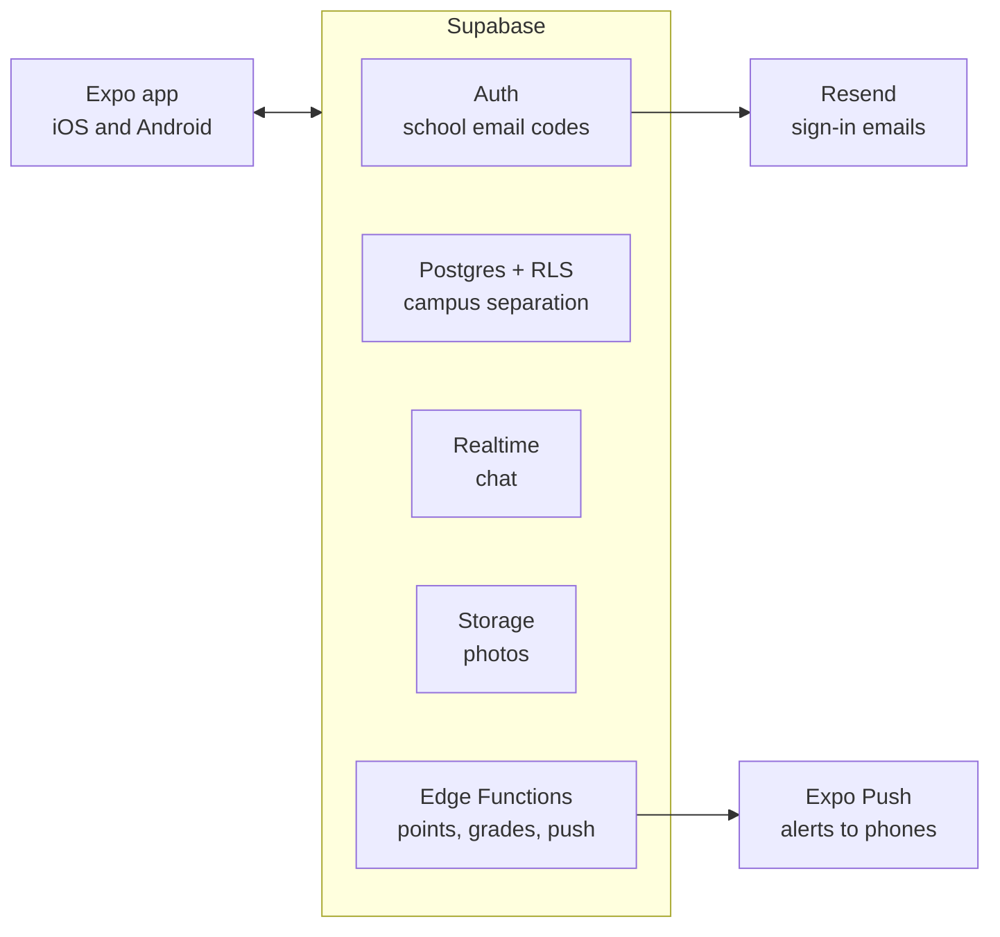

# Campus Market: Project Proposal

Campus Market is a mobile app where students buy and sell only with verified students from their own school, plus an open market that anyone can join.

**Repository:** https://github.com/SIGMobile-UIUC/Campus-market-app

## Idea

Students trade in group chats and general marketplaces where nobody is verified, so scams and no-shows go unchecked. Campus Market gives each school a private market behind its school email (for example, `@illinois.edu`), a letter trust grade that shows who is reliable, and points that unlock avatar and pet customization.

## Key features

- **Campus-only markets:** Sign-up uses a one-time code sent to an email. A listed school domain places the user in their campus market. Each campus has its own colors, banner, recommended meetup spots and admins.
- **Open market:** Open to anyone who signs up with an email. Verified students carry a school badge, so buyers can see who is a student. Students choose per listing: campus only, or also the open market.
- **Trust grade:** C < B− < B (start) < B+ < A− < A < A+, read like a school grade. Completed trades and good reviews raise it. Poor reviews or one violation, such as a no-show, drop it to B−; only repeated violations reach C. Points can never buy a grade.
- **Points, avatar and pet:** Users earn points from confirmed trades, reviews and giveaways, and spend them on avatar parts and pet items. Points have no cash value. All point logic runs on the server, with daily caps against abuse.
- **Market insights:** Anonymous, campus-level trends such as popular searches, resale prices and time to sell.

Borrowed from other marketplaces: post-trade reviews, bumping and keyword alerts (Karrot), verified badges and safe meetup spots (OfferUp), favorites and offers (Mercari), quick replies (Facebook Marketplace), and pet growth and streaks (Finch, Duolingo).

## Tech stack

| Layer | Choice |
| --- | --- |
| App | React Native (Expo), TypeScript |
| Backend | Supabase: Postgres, Auth, Realtime, Storage, Edge Functions |
| Access control | Postgres row-level security keeps each campus's listings private |
| Push and email | Expo Notifications, Resend |

We start on Supabase to move fast. It runs on standard Postgres, so we can move to our own server later if cost or scale requires it.

## MVP

- Email sign-in, with the campus assigned by school domain (2 to 3 schools to start) and the open market for everyone else
- Campus and open market feeds; listings with photos, search, filters and favorites
- Campus theme colors and meetup spots
- One-to-one chat with photos and push notifications
- Meetup trades proposed in chat with price, time and place; completion, two-way reviews and trust grade
- Points, an avatar and a small item shop
- Reports with automatic flagging, no-show disputes, and an admin view
- Consent screen and event logging

**Done when:** a student signs up, lists an item, agrees on a meetup in chat and completes the trade, and both users see their grade and points update. A student at another school, or a user without a school email, sees the listing only if it was posted to the open market.

## After the MVP

Escrow payments with shipping trades, the pet, keyword and price-drop alerts, bumping listings with points, distance filters, and seasonal events.

## Business model and privacy

Students are early adopters who shape what the next generation buys. After the MVP we plan to earn from campus-level trend reports, sponsored deals, and surveys that reward students with points.

- We share only anonymous totals, and hide any group smaller than 20 people.
- Chat messages are never used for ads or analytics.
- Interest-based ads go only to users who opt in. We do not collect background location, contacts or biometric data.
