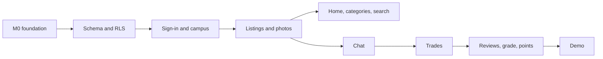

# Campus Market: Implementation Plan

| | |
| --- | --- |
| Goal | MVP demo in December 2026 (all demo-critical P0 from `docs/SPEC.md`) |
| Window | 9 build weeks, Oct 5 to Dec 6, plus demo week Dec 7 to 11 |
| Assumptions | 3 to 4 part-time developers; demo date to be confirmed; Move-out sales and Wanted are part of the demo |

## 1. Scope for the demo

The proposal's done-when is the bar: a student signs up, lists an item, agrees on a meetup in chat, completes the trade, and both users see grade and points update. A user from another school, or without a school email, sees the listing only if it is in the open market. The demo also shows a move-out sale bought as several items in one trade, and a wanted request answered with an offer.

| Tier | What | Rule |
| --- | --- | --- |
| Demo-critical | Sign-in and campus assignment, onboarding, listings with photos, move-out sales (bundles, multi-item trades), wanted requests and offers, Home with all modules, Categories, results, search, listing page, favorites, chat, trade proposal, accept, complete, cancel, reviews, rank, points, Me tab, campus separation tests | Nothing ships to the demo without these |
| P0, after the critical path | Reports, blocks, auto-hide, admin queue, no-show disputes, shop and avatar, check-in, consent and event logging, account deletion, photo purge | Built in weeks 7 to 9; any that slip move to P1 with a note in the spec, in this order: shop and avatar editor, photo purge, event logging, account deletion |

## 2. Repository and tooling

```
apps/mobile/            Expo app (TypeScript, Expo Router)
  src/app/              routes: (tabs)/index (Home), categories, chats, me; sell sheet; (auth) from M1
  src/features/<name>/  screens, hooks, API calls per feature
  src/ui/               tokens, ThemeProvider, components
  src/lib/              supabase client, media, analytics queue, errors
supabase/
  migrations/           SQL, one file per change, source of truth for the schema
  functions/            Edge Functions (push-dispatch, push-receipts, media-purge, delete-account)
  tests/                pgTAP
  seed.sql              campuses, domains, zones, spots, categories, shop items, rule values
tests/race/             concurrency scripts against the local stack
docs/                   SPEC.md, this plan
```

| Tool | Use |
| --- | --- |
| Node LTS, npm | Package manager; no monorepo tool until it is needed |
| Expo SDK (current), Expo Router, TypeScript strict | App |
| NativeWind 4 (Tailwind 3 syntax) | Styling; neutrals and campus colors as CSS variables at runtime |
| TanStack Query, React Context | Server data, session and theme |
| Supabase CLI, Docker Desktop | Local stack (`supabase start`), migrations, pgTAP (`supabase test db`) |
| EAS CLI | Dev client and preview builds (free plan) |
| ESLint, Prettier, `tsc --noEmit` | Lint and type check |
| GitHub Actions | PR checks (section 6) |

## 3. Environments and accounts

| Environment | Backend | App |
| --- | --- | --- |
| Local | `supabase start` with `seed.sql` | Expo dev client on a phone or emulator |
| Staging | Supabase free project; Resend for sign-in codes | EAS preview builds for the team and testers |
| Production | Created for the beta, not needed for the demo | |

Needed before week 2: a Supabase organization owned by the team, an Expo account, a sending domain for Resend (SPF, DKIM, DMARC), and secrets stored in GitHub Actions and EAS. Needed before iOS builds: an Apple Developer account ($99 per year). Android dev builds work without a store account.

## 4. Milestones

Weeks run Monday to Sunday. Each milestone ends with a demo of its slice on staging.

### M0 · Foundation (week 1, Oct 5 to 11)

| ID | Task | Area | Status |
| --- | --- | --- | --- |
| INF-1 | Scaffold `apps/mobile` (Expo SDK 57, TypeScript, Expo Router in `src/app`) and `supabase/` (CLI init); README setup steps | Platform | Done |
| INF-2 | ESLint, Prettier, type check; GitHub Actions PR workflow; branch protection on `main` | Platform | Done; branch protection needs a repo admin |
| INF-3 | Staging Supabase project; local and staging env wiring | Platform | Waiting for the Supabase organization |
| INF-4 | EAS project; Android dev client build; iOS once the Apple account exists | Platform | Waiting for the Expo account |
| APP-1 | ThemeProvider (campus colors and dark mode as CSS variables), base components: Button, Chip, ModeTile, CategoryTile, TabBar with the raised Sell button | App | Done; ListingCard arrives with listings in M2 |
| APP-2 | Navigation shell: `(tabs)` Home, Categories, Chats, Me, Sell sheet | App | Done; `(auth)` arrives with onboarding in M1 |

Done when: a fresh clone runs the app in under 15 minutes by following the README, and CI passes on a pull request. Checked on an Android emulator (API 36) with Expo Go: tabs, market toggle, Sell sheet and dark mode.

### M1 · Identity and campuses (weeks 2 to 3, Oct 12 to 25)

| ID | Task | Area |
| --- | --- | --- |
| DB-1 | Types, `campuses`, `campus_domains`, `campus_zones`, `meetup_spots`, `zip_codes` (Illinois subset for the demo), `app_config` | Backend |
| DB-2 | `profiles`, `private.accounts`, `user_roles`, `user_settings`, `consents`; profile creation on email confirmation | Backend |
| DB-3 | Before User Created hook: plus addresses, disposable domains, tombstones; Resend as the auth SMTP on staging | Backend |
| DB-4 | RLS on every table, function security lint, pgTAP harness with the RLS matrix users (same campus, other campus, waitlist, general, suspended, banned) | Backend |
| DB-5 | Seed: two live campuses (Illinois, Purdue) and one waitlist campus (Michigan), categories from spec 1.7.5, rule values | Backend |
| APP-3 | Onboarding: email, 6-digit code, campus reveal, ZIP for general users, nickname and avatar, rules and consent; session in SecureStore | App |
| APP-4 | Home header with campus name and market toggle; theme switches with the campus | App |

Done when: a UIUC email lands in the Illinois market with Illinois colors, a Gmail address lands in the open market, and the pgTAP suite passes in CI.

### M2 · Listings and discovery (weeks 3 to 5, Oct 19 to Nov 8)

| ID | Task | Area |
| --- | --- | --- |
| DB-6 | `listings`, `items`, `listing_photos`, `favorites`; `create_listing` for all three kinds (item, bundle of 2 to 30, wanted with budget), `update_listing`, `close_listing`, `delete_listing`, `mark_sold_elsewhere`; item-count check per kind; prohibited-keyword and area trigger; daily posting limits | Backend |
| DB-7 | `feed` and `search_listings` with modes, categories, filters, keyset paging; full-text plus trigram search; indexes from spec 5.4 | Backend |
| APP-5 | `src/lib/media`: camera and library, resize, WebP with JPEG fallback, size targets, blurhash, upload, signed URL batches | App |
| APP-6 | Sell flow: type picker, one item and Give it away (photos, details with category and subcategory, price, trade options, preview), Move-out sale (add, reorder and price up to 30 items), Wanted request (title, budget, category) | App |
| APP-7 | Home (modes, Picked for you, first nine categories plus More, Hot this week), Categories tab with all 21 categories and their subcategories in two panes (spec 1.7.5), Category results, Search | App |
| APP-8 | Listing page, favorites, similar items, locked preview for campus-only links | App |
| APP-20 | My listings on the Me tab: Selling, Reserved and Sold tabs; edit, close, reopen and mark sold elsewhere | App |
| APP-16 | Move-out sale page (item rows, status, multi-select) and the Home module | App |
| APP-17 | Wanted board, request page and the Home module | App |
| TST-1 | pgTAP: listing visibility for every RLS matrix user; storage policies on `listing-photos` | Backend |

Done when: a student posts with photos in under a minute, students at another campus and general users cannot see it unless it is in the open market, and the RLS tests prove it.

### M3 · Chat and trades (weeks 5 to 7, Nov 2 to 22)

| ID | Task | Area |
| --- | --- | --- |
| DB-8 | `chats`, `messages`, `chat_reads`; `get_or_create_chat`, `send_message` with per-chat sequence, `mark_read`, `leave_chat`; broadcast trigger and `realtime.messages` policy | Backend |
| DB-9 | `trades`, `trade_items`, `trade_confirmations`; propose with several items of a bundle or an offer on a wanted request, accept (reserve all or none), decline, withdraw, cancel with late-cancel penalty, confirm and completion (counted flags, point awards) | Backend |
| DB-10 | `trades-advance` job: proposal expiry, auto-complete after 72 hours, expiry after 7 days | Backend |
| FN-1 | `push-dispatch` and `push-receipts`; push token registration; webhooks after commit | Backend |
| APP-9 | Chat list and room: realtime, gap fill, read state, quick replies, photo messages, safety banner, leave chat | App |
| APP-10 | Proposal sheet (items picked from a bundle carry over from the move-out sale page), trade cards with current actions, trade details, My trades | App |
| APP-18 | Offer sheet from "I have this": photos, item, price against the budget, condition; sending opens a chat with a proposal | App |
| APP-11 | Review sheet after completion | App |
| TST-2 | Race tests: double reservation, confirm against the job, dispute against the job | Backend |

Done when: two phones complete a trade end to end on staging, with push notifications, and the race tests pass.

### M4 · Trust, points and safety (weeks 7 to 8, Nov 16 to 29; Thanksgiving week is light)

| ID | Task | Area |
| --- | --- | --- |
| DB-11 | `reviews`, `penalties`, `rank_stats`; `rank-recompute` job reading `app_config.rank_rules` | Backend |
| DB-12 | `wallets`, `points_ledger`, `award_points`, `purchases`, `inventory`, `avatar_loadout`, `checkins`; shop seed | Backend |
| DB-13 | `reports`, `blocks`, auto-hide trigger, `enforcement_actions`, `private.admin_log`; admin queue, resolve, enforce, set config | Backend |
| DB-14 | No-show disputes: open, respond, evidence, admin decision; evidence bucket | Backend |
| APP-12 | Me tab: grade card with progress, wallet and history, daily check-in, shop and avatar editor (SVG layers) | App |
| APP-13 | Report and block menus; account status page; admin queue and case view for admins | App |
| APP-14 | Dispute flow with in-app camera evidence | App |
| APP-19 | Settings: notifications, privacy and consent changes, blocked users, community rules, contact address, account (entry to account deletion) | App |
| TST-3 | Race test for the daily points cap; pgTAP for trust grades and points rules | Backend |

Done when: after a completed trade both users see their new points and, once the job runs, their grade; a report from three users hides a listing.

### M5 · Data, hardening and demo (week 9, Nov 30 to Dec 6)

| ID | Task | Area |
| --- | --- | --- |
| DB-15 | `private.events`, `log_events`, `app_config.event_catalog`; `daily-maintenance` job (cleanup, purge, wallet audit) | Backend |
| APP-15 | Analytics queue with consent; the P0 event catalog from spec 4.17.5 | App |
| FN-2 | `delete-account` and `media-purge` | Backend |
| INF-5 | Merge to `main` applies migrations to staging; preview builds for testers | Platform |
| QA-1 | Real-device pass on iOS and Android, demo seed data, demo script rehearsed twice | All |

Feature freeze: Monday, Nov 30. Week 10 is for fixes and the demo only.

## 5. Critical path



Backend leads app by about one week: each app task starts once its functions exist on the local stack. App work on design-system components and screens with mock data can start in M0.

## 6. Working agreements

- Branch per task, pull request to `main`, never a direct push. Required checks: lint, type check, unit tests, migration lint, pgTAP, and from M3 the race tests.
- A pull request that changes behavior updates `docs/SPEC.md` in the same pull request.
- Migrations are additive and never edited after merge; a fix is a new migration.
- Every new table ships with RLS and a row in the pgTAP matrix in the same pull request.
- Task IDs in this plan become GitHub issues; one owner per issue.
- Weekly 30-minute sync: milestone status, blockers, scope cuts.

## 7. Risks

| Risk | Mitigation |
| --- | --- |
| School mail filters block sign-in codes | Set up Resend and test with real UIUC and Purdue inboxes in week 2 |
| RLS mistakes leak campus listings | RLS matrix tests from M1; no table merges without them |
| Realtime and push take longer than planned | Start DB-8 and FN-1 at the start of M3; polling fallback for the demo if needed |
| iOS builds blocked on the Apple account | Android-first dev builds; buy the Apple account in week 1 if iOS is in the demo |
| Scope is large for a part-time team, more so with move-out sales and wanted in the demo | Tiers in section 1; cut the P0 remainder in the listed order, never the critical path |

## 8. Decisions needed before week 2

| Decision | Default if nobody objects |
| --- | --- |
| Team members, roles and demo date | Owners assigned per area: Platform, Backend, App (1 to 2 people) |
| Demo campuses | Illinois and Purdue live, Michigan waitlist |
| Who owns the Supabase org, Expo account, Apple account and sending domain | The project lead's accounts, shared with the team |
