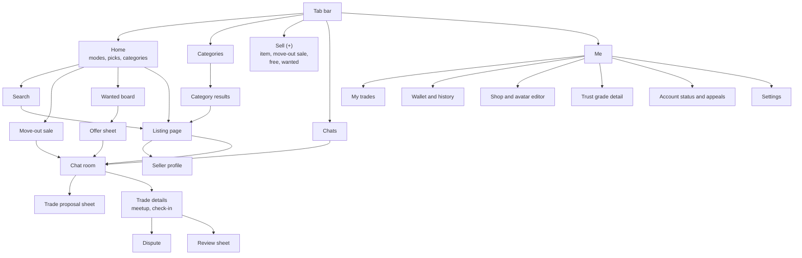
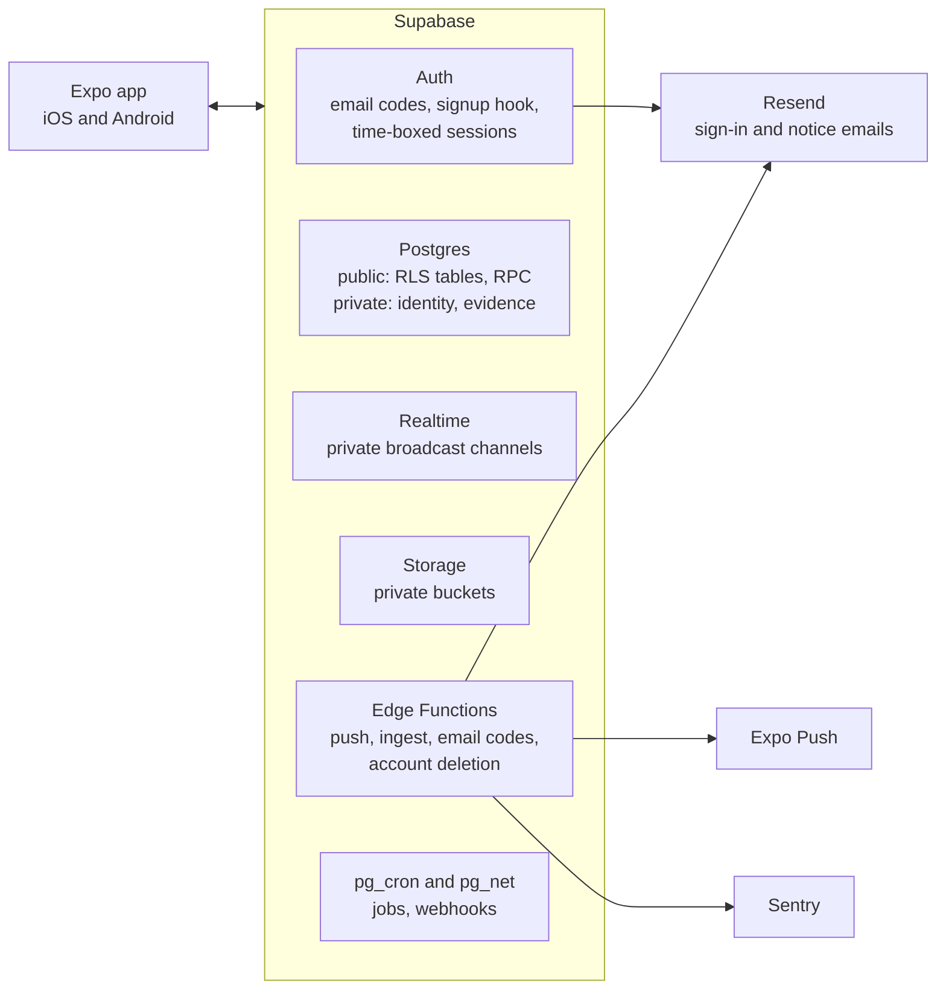
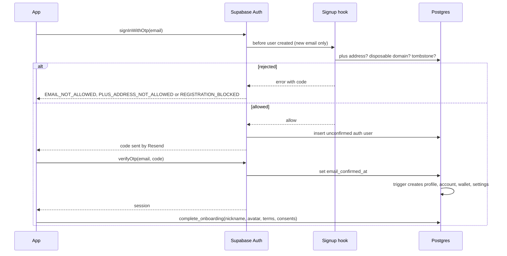
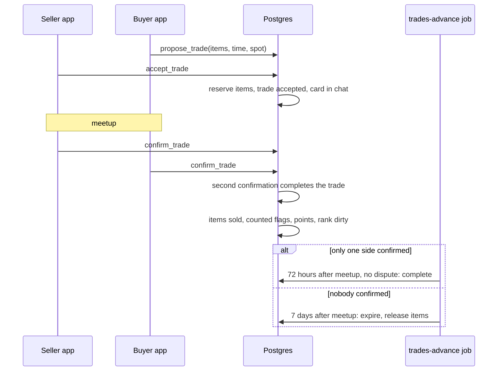
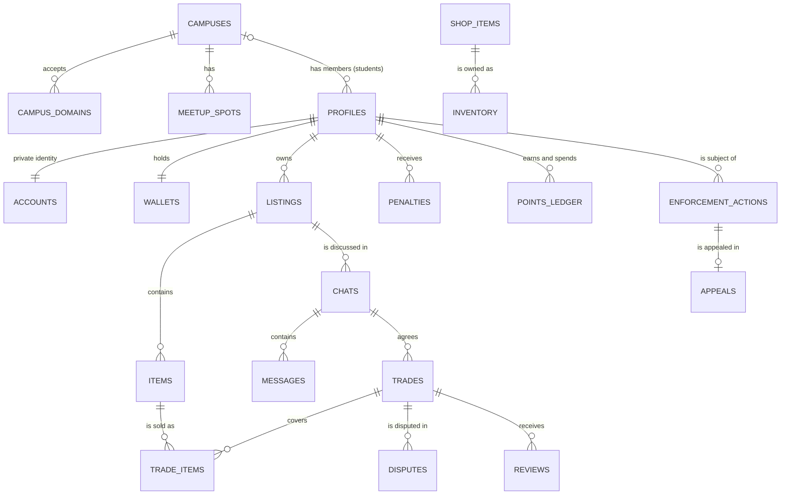
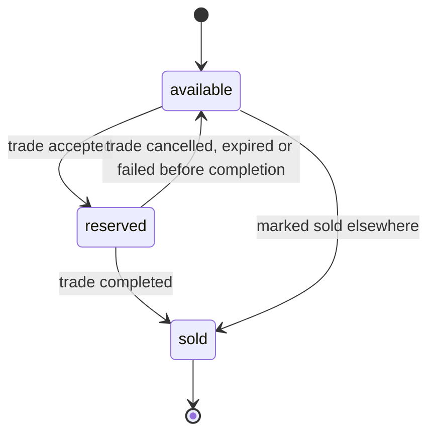
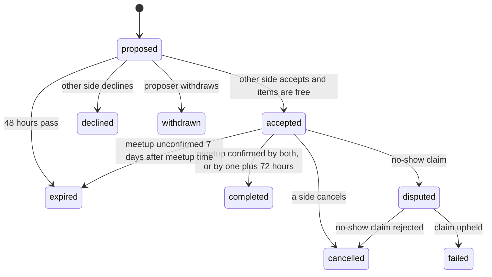
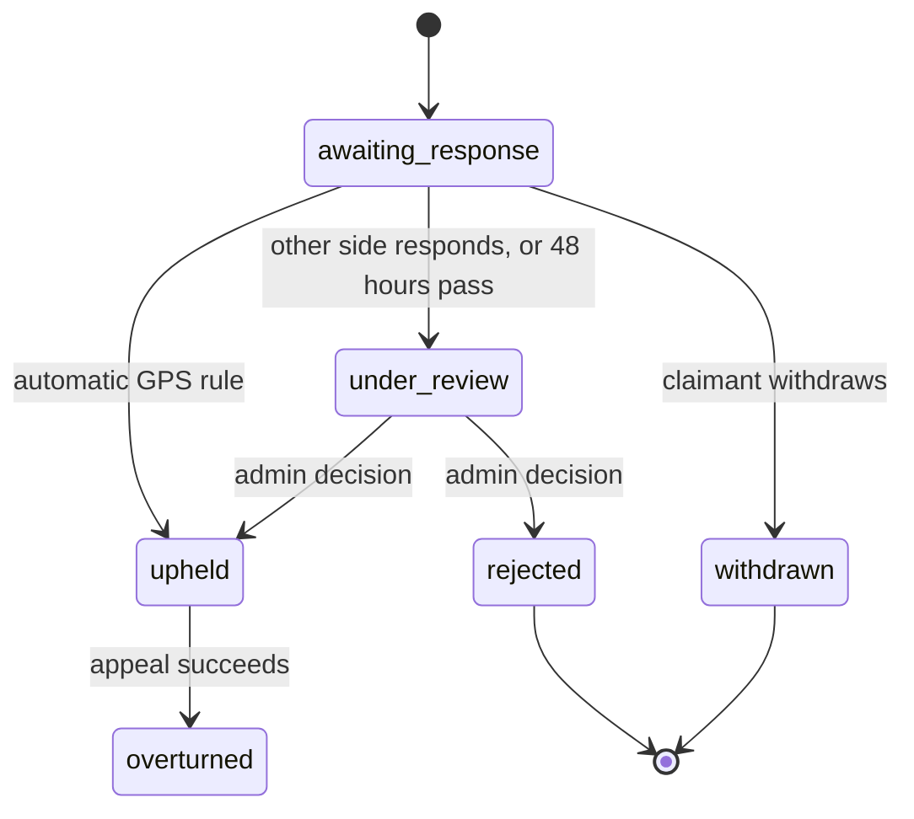
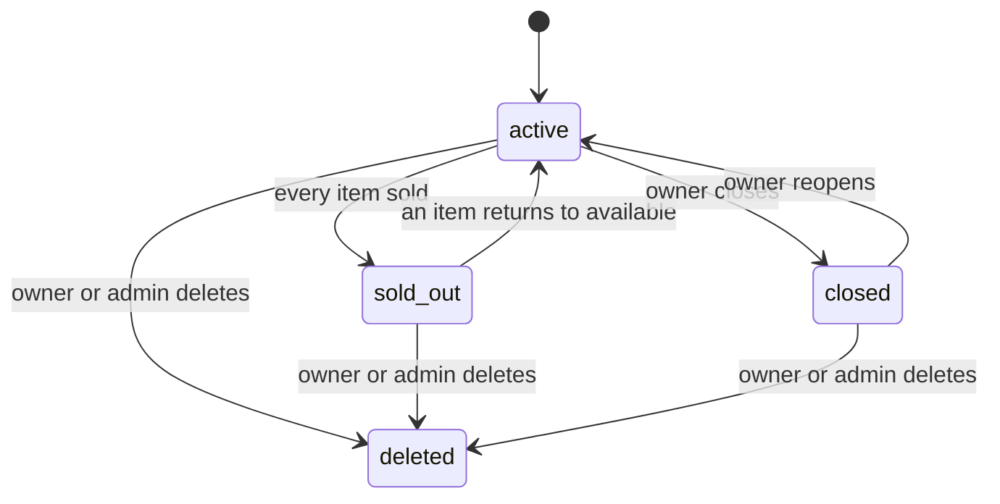
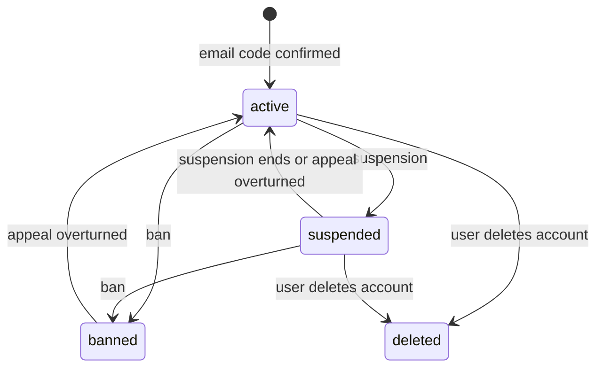

# Campus Market: Product and Technical Specification

| | |
| --- | --- |
| Status | Version 0.4, draft for team review |
| Last updated | 2026-10-06 |
| Scope | Product requirements, policies, user experience, technical design, data model and API in one document |

Campus Market is an iOS and Android marketplace: a private market per school behind its email domain for verified students, an open market anyone can join with an email, meetup trades at launch with escrow-backed shipping after the MVP, a letter trust grade from C to A+, and points for cosmetics.

**How to read:** Part 1 says what we build and why, Part 2 the rules we enforce, Part 3 what users see, Part 4 how it works, Part 5 what is stored, Part 6 how the app calls the backend, Part 7 what comes after the MVP. Appendix A records decisions; Appendix B traces every requirement to its design.

**Change process:** a pull request that changes behavior updates this document in the same pull request. Rule values (rank, points) live in `app_config` and change there (sections 4.12 and 4.13); this document records the starting values.

## Contents

- [Glossary](#glossary)
- [Part 1: Product](#part-1-product)
    - [1.1 Summary](#11-summary)
    - [1.2 Problem](#12-problem)
    - [1.3 Goals and non-goals](#13-goals-and-non-goals)
    - [1.4 Success metrics](#14-success-metrics)
    - [1.5 Users](#15-users)
    - [1.6 Feature requirements](#16-feature-requirements)
    - [1.7 Rules (version 1)](#17-rules-version-1)
    - [1.8 Non-functional requirements](#18-non-functional-requirements)
    - [1.9 Release plan](#19-release-plan)
    - [1.10 Out of scope](#110-out-of-scope)
- [Part 2: Policies](#part-2-policies)
    - [2.1 Platform role and liability](#21-platform-role-and-liability)
    - [2.2 Prohibited items](#22-prohibited-items)
    - [2.3 Adult items](#23-adult-items)
    - [2.4 Sponsored content](#24-sponsored-content)
    - [2.5 Points](#25-points)
    - [2.6 Reputation and penalties](#26-reputation-and-penalties)
    - [2.7 Disputes and evidence](#27-disputes-and-evidence)
    - [2.8 Enforcement](#28-enforcement)
    - [2.9 Appeals (P1)](#29-appeals-p1)
    - [2.10 Logs](#210-logs)
    - [2.11 Data sharing](#211-data-sharing)
    - [2.12 Data retention](#212-data-retention)
    - [2.13 Legal requests](#213-legal-requests)
- [Part 3: User Experience](#part-3-user-experience)
    - [3.1 Design principles](#31-design-principles)
    - [3.2 Navigation](#32-navigation)
    - [3.3 Screen inventory](#33-screen-inventory)
    - [3.4 Wireframes](#34-wireframes)
    - [3.5 Key flows](#35-key-flows)
    - [3.6 Design system](#36-design-system)
    - [3.7 Screen states](#37-screen-states)
    - [3.8 Gamification UI](#38-gamification-ui)
    - [3.9 Safety UX](#39-safety-ux)
    - [3.10 Accessibility](#310-accessibility)
    - [3.11 UI implementation](#311-ui-implementation)
    - [3.12 Design process](#312-design-process)
- [Part 4: Technical Design](#part-4-technical-design)
    - [4.1 Overview](#41-overview)
    - [4.2 Technical goals and non-goals](#42-technical-goals-and-non-goals)
    - [4.3 Architecture](#43-architecture)
    - [4.4 Tech stack](#44-tech-stack)
    - [4.5 Repository layout](#45-repository-layout)
    - [4.6 Identity and access](#46-identity-and-access)
    - [4.7 Listings, items and media](#47-listings-items-and-media)
    - [4.8 Discovery](#48-discovery)
    - [4.9 Chat and real-time](#49-chat-and-real-time)
    - [4.10 Trade engine](#410-trade-engine)
    - [4.11 Disputes and evidence](#411-disputes-and-evidence)
    - [4.12 Reviews and rank engine](#412-reviews-and-rank-engine)
    - [4.13 Points economy engine](#413-points-economy-engine)
    - [4.14 Avatar, shop and pet](#414-avatar-shop-and-pet)
    - [4.15 Moderation and enforcement](#415-moderation-and-enforcement)
    - [4.16 Push and notifications](#416-push-and-notifications)
    - [4.17 Data collection and sharing](#417-data-collection-and-sharing)
    - [4.18 Concurrency and consistency](#418-concurrency-and-consistency)
    - [4.19 Background jobs](#419-background-jobs)
    - [4.20 Security and threat model](#420-security-and-threat-model)
    - [4.21 Capacity and cost](#421-capacity-and-cost)
    - [4.22 Observability](#422-observability)
    - [4.23 Testing](#423-testing)
    - [4.24 Environments and release](#424-environments-and-release)
    - [4.25 Store compliance](#425-store-compliance)
    - [4.26 Technical risks](#426-technical-risks)
- [Part 5: Data Model](#part-5-data-model)
    - [5.1 Entities](#51-entities)
    - [5.2 State machines](#52-state-machines)
    - [5.3 Schema](#53-schema)
    - [5.4 Indexes](#54-indexes)
    - [5.5 Deletion and retention behavior](#55-deletion-and-retention-behavior)
    - [5.6 Rules data](#56-rules-data)
- [Part 6: API](#part-6-api)
    - [6.1 Conventions](#61-conventions)
    - [6.2 Errors](#62-errors)
    - [6.3 Accounts](#63-accounts)
    - [6.4 Listings](#64-listings)
    - [6.5 Chat](#65-chat)
    - [6.6 Trades](#66-trades)
    - [6.7 Disputes and reviews](#67-disputes-and-reviews)
    - [6.8 Points, shop, avatar, pet](#68-points-shop-avatar-pet)
    - [6.9 Safety](#69-safety)
    - [6.10 Admin](#610-admin)
    - [6.11 Edge Functions](#611-edge-functions)
- [Part 7: After the MVP](#part-7-after-the-mvp)
    - [7.1 Escrow and shipping](#71-escrow-and-shipping)
- [Appendix A: Decision log](#appendix-a-decision-log)
- [Appendix B: Traceability](#appendix-b-traceability)

## Glossary

| Term | Meaning |
| --- | --- |
| School | A university, identified by its email domains |
| Campus | A school's record in the app; `live` campuses have a campus market, `waitlist` campuses do not yet |
| Campus market | Listings visible only to students of one live campus |
| Open market | Listings visible to every signed-in user, students and general users alike |
| Student | An account signed up with a listed school email; carries a verified-student badge |
| Waitlist student | A student whose school is recognized but not live; uses the open market only |
| General user | An account signed up with any other email; uses the open market only, without a school badge |
| Area | Where an open-market listing is picked up: the seller's campus for students, a ZIP code for general users |
| Listing | A post. Kinds: `item` (one item), `bundle` (2 to 30 items), `wanted` (a request with a budget) |
| Item | The unit that is reserved and sold; belongs to a listing |
| Trade | An agreement between one seller and one buyer for one or more items, by meetup (shipping with escrow comes after the MVP, Part 7) |
| Counted trade | A completed trade that counts toward rank: price above 0 (free trades count for the giver), once per pair of users per 7 days |
| Dispute | A claim on a trade: no-show (shipping claims come with escrow, Part 7) |
| Penalty points | Reputation penalties from upheld disputes and violations; expire after 90 days |
| Enforcement action | A moderation action on an account: warning, removal, suspension, ban (feature restriction from P1) |
| Points | Non-cash, non-transferable in-app currency; a wallet balance can be negative |
| Rule values | Rank and points values stored as JSON in `app_config`, changed by a super admin without an app release |
| Tombstone | A hashed record that blocks re-registration of a banned account (from P1, also of a deleted account with active penalties) |

## Part 1: Product

### 1.1 Summary

Campus Market is an iOS and Android marketplace. Every school has a private campus market behind its school email domain, open only to its verified students. Next to it, an open market is open to anyone who signs up with an email; students there carry a verified-student badge. Students who want verified, local trades use their campus market. At launch trades happen in person and the platform handles no money; escrow-backed shipping comes after the MVP (Part 7). A letter trust grade, read like a school grade from C to A+, shows who is reliable, and points from good trades buy avatar, pet and profile cosmetics.

### 1.2 Problem

- Student resale happens in group chats, Discord servers and general marketplaces. Anyone can post, nobody is verified, and listings disappear in the scroll.
- Buyers cannot tell whether a seller is a real student or how reliable they are. Scams, no-shows and fake listings go unchecked.
- Demand is seasonal and local: move-in and move-out weeks, textbooks per course, furniture per dorm area. General marketplaces do not organize around a campus.

### 1.3 Goals and non-goals

#### Goals

| ID | Goal | Description |
| --- | --- | --- |
| G1 | Trust | Every campus-market account belongs to a verified student, the open market shows who is a verified student, and each user's reliability is visible before a trade. |
| G2 | Campus identity | Each school has its own market with its colors, zones, meetup spots and admins. |
| G3 | Liquidity | Items sell fast enough that students list on Campus Market first. |
| G4 | Engagement | Students return when they are not selling, for points, cosmetics, their pet and events. |
| G5 | Insight | Anonymous, campus-level trend data that funds the product without selling personal data. |
| G6 | Scale | New campuses launch through configuration, with no code changes, on a small budget. |

#### Non-goals (MVP)

- Handling payments or holding money. Buyers and sellers pay each other directly at the meetup. Escrow comes after the MVP (Part 7).
- Shipping trades. They arrive together with escrow (Part 7).
- Buying shipping labels or integrating carrier tracking.
- A web app.
- Housing, sublease and event ticket listings.

### 1.4 Success metrics

| Metric | Definition | UIUC beta target (first semester) |
| --- | --- | --- |
| Verified students | Accounts that confirmed a school email | 1,000 |
| Weekly active users | Users who open the app at least once in a calendar week | 400 |
| Completed trades | Trades in status `completed` | 300 |
| Sell-through rate | Items sold within 14 days of posting | 35% |
| Time to first chat | Median time from posting to the first incoming chat | Under 6 hours |
| 4-week retention | New users active in their fourth week | 30% |
| Report rate | Upheld reports per 1,000 listings | Under 5 |
| No-show rate | Upheld no-show disputes per 100 accepted meetup trades | Under 3 |
| Analytics opt-in | Users who allow anonymous analytics | 60% |

### 1.5 Users

| Persona | Situation | Needs |
| --- | --- | --- |
| Moving-out senior | A room of furniture and two weeks to clear it | List many items at once, sell items to different buyers, meet near their building |
| Incoming freshman | Needs a desk, a mini fridge and textbooks on a budget | Cheap items nearby, a trustworthy seller, textbooks by course |
| International student | Arrives with nothing and does not know the area | Safe meetup spots, clear prices, sellers who are clearly students |
| Off-campus buyer | A local resident or a student from another school looking for deals | Browse the open market, see who is a verified student, meet in a public place |
| Campus admin | Student volunteer who keeps the market clean | A moderation queue, clear authority limits, an audit trail |

### 1.6 Feature requirements

Priority: **P0** is required for the MVP demo, **P1** for the public beta, **P2** after the beta. Rule values (points, rank, time windows) are listed in section 1.7 and live in `app_config`, so they change without an app release.

#### 1.6.1 Accounts

| ID | Requirement | Priority | Acceptance criteria |
| --- | --- | --- | --- |
| ACC-1 | Sign in with an email and a 6-digit code | P0 | A live-campus domain lands in that campus market. A recognized school without a live market gets the open market with a verified-student badge and joins its campus waitlist. Any other email becomes a general account with the open market only. Disposable email domains and addresses with `+` in the local part are rejected. |
| ACC-2 | One account per mailbox | P0 | An email can hold one account. An account is created only after the code is confirmed. |
| ACC-3 | Onboarding | P0 | Nickname, starter avatar, terms and community rules acceptance, analytics and ad consent choices. General users also set a ZIP code as their default area. Push permission is asked at the first chat or first listing. |
| ACC-4 | Public profile | P0 | Nickname, school badge (students only), trust grade badge, review tag counts, active listings, member-since date, typical reply time. Email and real name are never shown. |
| ACC-5 | Sessions and graduation | P1 | No separate re-verification. Sessions end after 180 days, or after 90 days without use, and signing back in needs a code sent to the sign-in email. A graduate whose school email has closed loses the campus market and can join the open market with a personal email. Needs the Pro plan's session settings, so it starts with the beta. |
| ACC-6 | Secondary email | P1 | An optional personal email, verified by code, receives account notices (dispute results, enforcement actions, policy changes). It can never be used to sign in. |
| ACC-7 | Account status page | P0 | Shows penalty points with expiry dates and enforcement actions with reasons and end dates. Appeal buttons arrive with appeals (P1). |
| ACC-8 | Account deletion inside the app | P0 | Code confirmation, then personal data removal. Other users see "Deleted user". A banned email can never sign up again; from P1, an account deleted with active penalties cannot be re-created for the period in [Policies](#28-enforcement). |
| ACC-9 | Notification settings | P1 | On or off per type: chats, trade updates, disputes, favorites, alerts, announcements. Lock-screen message previews can be hidden. |
| ACC-10 | Invite classmates | P2 | The inviter earns points after the invitee completes a first trade. |

#### 1.6.2 Campus

| ID | Requirement | Priority | Acceptance criteria |
| --- | --- | --- | --- |
| CMP-1 | Campus theme | P0 | Primary and accent colors and a banner per campus. Text on campus colors meets WCAG AA contrast. |
| CMP-2 | Zones and meetup spots | P0 | Each campus defines pickup zones and public meetup spots with coordinates. Every meetup listing has a zone. |
| CMP-3 | Campus location | P0 | Each campus has coordinates, used as the area of its students' open-market listings. |
| CMP-4 | Campus announcements | P1 | Campus admins post a banner with start and end dates. |
| CMP-5 | Waitlist and campus launch | P1 | Waitlist count per recognized school. A super admin makes a campus live by adding its theme, zones and spots. |

#### 1.6.3 Listings

A listing contains one or more **items**, the units that are sold. See the [Glossary](#glossary).

| ID | Requirement | Priority | Acceptance criteria |
| --- | --- | --- | --- |
| LST-1 | Item listing | P0 | One item: 1 to 10 photos, title, category and subcategory (section 1.7.5), price or Free, negotiable toggle, condition, description. |
| LST-2 | Bundle listing, shown as a move-out sale | P0 | 2 to 30 items in one post, each with its own name, price, condition and photos. Each item sells separately, and several items can go to one buyer in one trade. |
| LST-3 | Wanted listing | P0 | A "Looking for" post with a budget and no items. Sellers respond in chat and offer what they have. |
| LST-4 | Free items | P0 | Price 0 shows as Free. The seller chooses the recipient from chats. |
| LST-5 | Trade method | P0 | Meetup only. Shipping comes with escrow after the MVP (Part 7). |
| LST-6 | Visibility | P0 | Campus only (default) or also the open market. Students of non-live schools and general users post only to the open market. |
| LST-7 | Manage a listing | P0 | Edit, delete, close. Mark any available item as sold elsewhere. |
| LST-8 | Prohibited items | P0 | Prohibited categories cannot be chosen, and a keyword filter blocks prohibited items at posting ([Policies](#22-prohibited-items)). |
| LST-9 | Adult items | P0 | Adult-oriented items are prohibited in the MVP ([Policies](#23-adult-items)). Allowing them with blur and an 18+ label is revisited after the MVP together with an age policy. |
| LST-10 | Textbook fields | P1 | Course code tag (for example, CS 124), searchable and filterable. |
| LST-11 | Share link | P1 | A link opens the listing in the app. Viewers outside the campus see a locked preview for campus-only listings. |
| LST-12 | Bump | P1 | Spend points to move a listing to the top of the feed (section 1.7.2). |
| LST-13 | ISBN scan | P2 | Scanning a textbook barcode fills title, edition and author. |
| LST-14 | Price hint | P2 | Shows the campus median sold price for similar items while setting a price. |
| LST-15 | Area | P0 | Open-market listings show the seller's area: the campus name for students, the city of a ZIP code for general users (their default ZIP, changeable per listing). |

#### 1.6.4 Discovery

| ID | Requirement | Priority | Acceptance criteria |
| --- | --- | --- | --- |
| DSC-1 | Campus and open feeds | P0 | A toggle switches markets; the current market is always clear from color and label. Students of non-live schools and general users see only the open market. |
| DSC-2 | Search and filters | P0 | Typo-tolerant search. Filters: category, price range, condition, zone (campus market), free only. Sort: newest, price low to high, price high to low. |
| DSC-3 | Open market distance | P1 | Open-market cards show the distance from the viewer's campus or ZIP code to the listing's area. Filter: within 10, 25 or 50 miles. Sort by distance. |
| DSC-4 | Favorites | P0 | Heart a listing and see it in Favorites. Sellers see the count. |
| DSC-5 | Recently viewed | P1 | Last 50 viewed listings on the device. |
| DSC-6 | Similar items | P1 | Items from the same category and market on the listing page. |
| DSC-7 | Keyword alerts | P2 | Saved keywords send a push when a matching listing is posted. |
| DSC-8 | Price-drop alerts | P2 | A push when a favorited item's price goes down. |
| DSC-9 | Follow sellers | P2 | New listings from followed sellers appear in a Following section. |
| DSC-10 | Verified students only | P1 | An open-market filter that shows only listings from verified students. |
| DSC-11 | Shopping modes | P0 | The top of Home has five mode tiles, kept apart from item categories: Free, Move-out sales, Wanted, Under $10 and Textbooks by course. Each opens a filtered feed. |
| DSC-12 | Home modules | P0 | Home shows, in order: search, shopping modes, Picked for you (recently viewed categories, newest first), Shop by category, Move-out sales near you, Students are looking for and Hot this week. Modules with no content are hidden. |
| DSC-13 | Category browsing | P0 | A Categories tab lists the categories of section 1.7.5 with their subcategories, and a result screen per subcategory with sort, filters and an "Alert me" button (alerts are DSC-7, P2). |

#### 1.6.5 Chat

| ID | Requirement | Priority | Acceptance criteria |
| --- | --- | --- | --- |
| CHT-1 | One chat per listing and person | P0 | Opening a chat on the same listing twice returns the same chat. The listing owner can hold chats with many people. |
| CHT-2 | Messages | P0 | Text, photos and quick replies ("Is this still available?", "When can you meet?"). |
| CHT-3 | Trade cards | P0 | Every trade step (proposal, acceptance, confirmation, dispute) appears as a card in the chat with its actions. |
| CHT-4 | Read state | P0 | Unread badges per chat and on the tab bar; read receipts. |
| CHT-5 | Push notifications | P0 | New messages, trade steps and dispute updates arrive as push notifications. |
| CHT-6 | Safety warnings | P0 | Safety tips before the first chat. A warning when a message asks for a verification code, a gift card or payment before meeting. |
| CHT-7 | Leave a chat | P0 | Either side can leave a chat unless a trade in it is proposed, accepted or disputed. The chat disappears from the leaver's list, and the other side sees "left the chat" and can no longer send messages. Contacting the same person about the same listing later starts a new chat. |
| CHT-8 | Chat retention | P0 | When both sides have left, the chat's messages and photos are deleted 7 days later. Chat photos are deleted 1 year after the chat's last message; the text stays and the photo shows as expired. Deletion waits while a report on the chat or a dispute on its trade is open. |

#### 1.6.6 Trades

A **trade** is an agreement between one seller and one buyer for one or more items, settled at a meetup. Its states are defined in [Data Model](#52-state-machines).

| ID | Requirement | Priority | Acceptance criteria |
| --- | --- | --- | --- |
| TRD-1 | Propose a trade | P0 | Either side proposes from the chat: items (any available items of the listing), total price, a time, and a meetup spot or place. For wanted listings, the responding seller describes the offered item and price. Proposals expire after 48 hours. |
| TRD-2 | Accept, decline, withdraw | P0 | The other side accepts or declines; the proposer can withdraw before acceptance. |
| TRD-3 | Reservation | P0 | Acceptance reserves the items. Other buyers see them as Reserved. If any item is no longer available at acceptance, the acceptance fails and nothing is reserved. |
| TRD-4 | Complete a meetup trade | P0 | Both sides tap "Completed". If one side confirmed and the other neither confirmed nor opened a dispute within 72 hours after the meetup time, the trade completes automatically. If neither confirms within 7 days, it expires and items return to available. |
| TRD-5 | Shipping trade | After the MVP | Escrow-backed shipping, described in [Part 7](#71-escrow-and-shipping). |
| TRD-6 | Cancel | P0 | Either side cancels an accepted trade with a reason; items return to available. Cancelling within 2 hours of the meetup time adds a late-cancel penalty. |
| TRD-7 | Sold elsewhere | P0 | The seller marks available items as sold outside the app. No trade, no points. |
| TRD-8 | Bundle trades | P0 | Different items of one bundle can be in different trades with different buyers at the same time. |
| TRD-9 | Trade history | P0 | Each user sees their trades by status, with the items and price at the time of the trade. |

#### 1.6.7 Disputes

| ID | Requirement | Priority | Acceptance criteria |
| --- | --- | --- | --- |
| DSP-1 | No-show claim | P0 | Either side of an accepted meetup trade can claim a no-show from 15 minutes to 48 hours after the meetup time. Both sides can claim against each other. |
| DSP-2 | Shipping claims | After the MVP | Not received and Not as described claims on escrow trades, described in [Part 7](#71-escrow-and-shipping). |
| DSP-3 | Photo evidence | P0 | Photos taken with the in-app camera (not the gallery), stamped with server time, attached to a claim or a response. |
| DSP-4 | GPS check-in | P1 | An "I'm here" button from 30 minutes before to 30 minutes after the meetup time records the phone's location once, only after the user allows location for this purpose. |
| DSP-5 | Response | P0 | The other side has 48 hours to respond with a statement and evidence. |
| DSP-6 | Resolution | P0 human review, P1 automatic rule | An admin decides each dispute as upheld or rejected: a campus admin when the listing belongs to a live campus, a super admin otherwise (the open-market queue). With GPS (P1), a no-show claim is upheld automatically when the claimant has a valid check-in, the other side has none and does not respond within 48 hours. |
| DSP-7 | Outcomes | P0 | Upheld: penalty points for the other side, the trade fails and its points are reversed. Rejected: no effect. Bad faith (a claim judged knowingly false): penalty points for the claimant. |

#### 1.6.8 Reviews and reputation

| ID | Requirement | Priority | Acceptance criteria |
| --- | --- | --- | --- |
| REP-1 | Reviews | P0 | After a completed trade, each side gives 1 to 5 stars, picks tags (section 1.7.3) and may add a comment, within 14 days. |
| REP-2 | Trust grade | P0 | Letter grades C, B−, B, B+, A−, A and A+, starting at B, shown on profiles, listing cards and chats. B− reflects poor reviews or one violation; C reflects repeated violations. Users see their grade, a progress bar to the next grade and general tips. The formula and thresholds (section 1.7.1) are internal and tuned after testing. |
| REP-3 | Penalty points | P0 | Penalties from upheld disputes, late cancellations and violations, each expiring after 90 days (section 1.7.1). |
| REP-4 | Top badge | P2 | A "Top 5%" chip next to A+, once at least 20 users hold A+. |
| REP-5 | Rule changes | P0 | Rank values live in `app_config` and change without an app release. |

#### 1.6.9 Points and cosmetics

| ID | Requirement | Priority | Acceptance criteria |
| --- | --- | --- | --- |
| PTS-1 | Wallet | P0 | Balance (which can be negative) and a full history of every change with its reason. |
| PTS-2 | Earning | P0 | Points from trades, reviews, giveaways, first trade and check-ins by the rules in section 1.7.2, with a daily cap. |
| PTS-3 | Spending | P0 shop and nickname, P1 bump | Shop cosmetics, nickname changes and bumps. Spending needs a balance at least equal to the price. |
| PTS-4 | Negative balance | P0 | Reversals can push a balance below zero. While negative, the user cannot spend, and new earnings pay off the debt first. |
| PTS-5 | Item shop | P0 | Items by slot and rarity, with prices. Some items are campus-only, time-limited or require a minimum trust grade. Purchases are final. |
| PTS-6 | Avatar | P0 | Slots: head, face, top, accessory, background, frame. One item per slot. The frame color follows the trust grade unless a frame item is equipped. |
| PTS-7 | Daily check-in | P0 | One check-in per local day (the user's time zone) with a streak counter. |
| PTS-8 | Pet | P1 | One pet with moods from recent activity: happy after trades and check-ins, sleepy after 7 days without activity, worried while the owner is B− or C. Treats from the shop improve mood for 3 days. |
| PTS-9 | Seasonal events | P2 | Limited items and bonus points during finals and move-out weeks. |
| PTS-10 | Weekly campus leagues | P2 | Weekly points leaderboards per campus with cosmetic rewards. |

#### 1.6.10 Safety and moderation

| ID | Requirement | Priority | Acceptance criteria |
| --- | --- | --- | --- |
| SAF-1 | Report | P0 | Report a listing, user or message with a reason. One report per user per target. |
| SAF-2 | Automatic hiding | P0 | A listing reported by 3 different users is hidden until an admin reviews it. |
| SAF-3 | Block | P0 | Blocked users cannot message each other and do not see each other's listings. |
| SAF-4 | Text filter | P0 | Prohibited words in listings, nicknames and messages are blocked. |
| SAF-5 | Moderation queue | P0 | Reports and disputes in one queue per campus, plus an open-market queue for super admins, with age and a 24-hour target. |
| SAF-6 | Terms and rules | P0 | Users accept the terms and community rules, including the zero-tolerance clause, before using the app. |
| SAF-7 | Enforcement | P0 | Admin actions follow the enforcement ladder and authority limits in [Policies](#28-enforcement). Every action records a reason code and the policy section. |
| SAF-8 | Appeals | P1 | A user appeals an action once, within 14 days. A different admin decides within 7 days. Until then, users contact the team through the published contact address. |
| SAF-9 | Audit logs | P0 | Enforcement actions and the admin log are append-only. Every admin view of private data (reported chats, evidence, GPS) is logged. |
| SAF-10 | Image moderation | P2 | Automatic screening of uploaded photos. |
| SAF-11 | Second-account detection | P2 | Flags new accounts that share devices with banned accounts. |

#### 1.6.11 Insights and business

| ID | Requirement | Priority | Acceptance criteria |
| --- | --- | --- | --- |
| INS-1 | Consent | P0 | Separate switches for anonymous analytics and personalized ads, changeable any time. |
| INS-2 | Event logging | P0 | Behavior events modeled on GA4's e-commerce events (impressions, clicks, views, searches, filters, wishlists, shares, sell-flow steps, price edits; section 4.17.5), only from users who allow analytics. Outcomes such as trades and prices come from service records. Chat content, GPS, evidence and advertising identifiers are never logged. |
| INS-3 | Internal trends dashboard | P1 | Campus-level totals for the team. |
| INS-4 | External trend reports | P2 | Reports for partners that follow the external sharing rules in [Policies](#211-data-sharing). |
| INS-5 | Sponsored deals | P2 | Ads matched to the category being browsed; interest targeting only with consent; restricted categories excluded. |
| INS-6 | Surveys | P2 | Opt-in surveys and product tests that reward points. |

#### 1.6.12 Notifications center

| ID | Requirement | Priority | Acceptance criteria |
| --- | --- | --- | --- |
| NTF-1 | In-app notifications | P1 | Trade steps, disputes, reviews received, favorites on my listings, enforcement actions and announcements, with read state. |

### 1.7 Rules (version 1)

#### 1.7.1 Trust grade

Trust is a letter grade, read like a school grade: C < B− < B < B+ < A− < A < A+. Everyone starts at B. Two grades sit below B on purpose, because an unfriendly trader is not a scammer: B− means poor reviews or one violation, C means repeated violations. One upheld no-show or harassment case (3 points) or three late cancellations lead to B−; a second upheld case leads to C. Tables and code keep the shorter internal name rank (`rank_stats`, `rank_rules`, `profiles.tier`).

These rules are internal. Users see their grade, a progress bar and general tips, never the formula or thresholds. The values below are a starting point, tuned after testing.

Rating is a Bayesian average with prior 4.0 and weight 10, so a few 5-star reviews do not equal a long record. A **counted trade** is a completed trade with a price above 0 (for free trades, it counts for the giver only), and the same pair of users counts once per 7 days.

| Grade | Meaning | Counted trades | Distinct partners | Rating | Account age | Penalty points (90 days) |
| --- | --- | --- | --- | --- | --- | --- |
| C | Repeated violations | Any | Any | Any | Any | 6 or more |
| B− | Needs improvement | Any | Any | Below 4.0 after 5 reviews | Any | 3 to 5 |
| B | Starting grade | | | | | 2 or fewer |
| B+ | Reliable | 10 | 7 | 4.3 | 30 days | 2 or fewer |
| A− | Very reliable | 30 | 20 | 4.5 | 90 days | 1 or fewer |
| A | Excellent | 75 | 45 | 4.6 | 180 days | 0 |
| A+ | Outstanding | 150 | 90 | 4.75 | 365 days | 0 |

- Order: C when penalty points reach 6; otherwise B− when penalty points reach 3 or the rating is below 4.0 after at least 5 reviews (either is enough); otherwise the highest grade whose every requirement is met; otherwise B.
- Rudeness lowers the grade through reviews (rating and negative tags, section 1.7.3) and can reach B−, never C. Only penalties from upheld disputes and violations reach C.
- There is no D or F. Behavior worse than C is handled by restriction, suspension or ban (section 2.8), not by a lower grade.
- A New tag shows until 3 counted trades, so a new B is not mistaken for a proven one.
- From P2, a "Top 5%" chip marks the top A+ users by score once at least 20 users hold A+.

| Penalty | Points |
| --- | --- |
| Upheld no-show | 3 |
| Upheld harassment or abuse | 3 |
| Late cancellation | 1 |
| Claim judged in bad faith | 3 |

Each penalty expires 90 days after it is given. Penalties for shipping claims come with escrow (Part 7).

#### 1.7.2 Points

| Earning | Points | Limit |
| --- | --- | --- |
| Paid trade completed, seller | 50 | Counted trades only; at most 3 trade awards per day |
| Paid trade completed, buyer | 30 | Same |
| Free trade completed, giver | 30 | At most 3 per day; the receiver earns nothing |
| Review written | 10 | One per trade |
| First counted trade | 100 | Once per user; outside the daily cap |
| Daily check-in | 5 | Once per local day; 20 extra on every 7th consecutive day |
| Invited classmate's first trade (P2) | 100 | 10 per semester |

Daily earning cap: 200 points.

| Spending | Points | Limit |
| --- | --- | --- |
| Common cosmetic | 150 | |
| Rare cosmetic | 400 | |
| Epic cosmetic | 1,000 | |
| Legendary cosmetic | 2,500 | |
| Limited (event) cosmetic | Set per event | Available only during the event |
| Pet treat (P1) | 20 | |
| Nickname change | 300 | First change within 7 days of sign-up is free; then once per 30 days |
| Bump a listing (P1) | 150 | Once per listing per 24 hours, 3 per user per day |

- Points have no cash value, cannot be bought with money and cannot be transferred.
- When a trade fails after completion or an admin reverses it, the points it earned are reversed, even if the balance goes negative.

#### 1.7.3 Review tags

| Positive | Negative |
| --- | --- |
| On time | Late |
| Item as described | Item not as described |
| Friendly | Rude |
| Fast replies | Slow replies |
| Fair price | Pushy about price |

Packing tags for shipping trades come with escrow (Part 7). No-shows are reported as disputes (section 1.6.7), never as review tags.

#### 1.7.4 Items

Prohibited items, including adult items in the MVP, are listed in [Policies](#22-prohibited-items).

#### 1.7.5 Categories

Item categories say what a thing is; shopping modes (DSC-11) say how to buy it. They are kept apart: Free, Wanted and Move-out are never categories, and no two categories overlap.

The size follows the large secondhand marketplaces, which use 14 to 20 top-level categories (Karrot about 20, Facebook Marketplace 18, OfferUp 14). The groups students trade most get their own category instead of hiding in a broad one: appliances, kitchen, bedding, textbooks, school supplies, video games, bikes and campus gear.

| # | Category | Subcategories |
| --- | --- | --- |
| 1 | Furniture | Desks, Chairs, Bed frames and mattresses, Couches and seating, Tables, Shelves and bookcases, Dressers and wardrobes |
| 2 | Appliances | Mini fridges, Microwaves, Fans and heaters, Air purifiers and humidifiers, Vacuums, TVs |
| 3 | Kitchen | Kettles and coffee makers, Rice cookers and air fryers, Cookware, Dishes and utensils, Food storage |
| 4 | Bedding and bath | Sheets and comforters, Mattress toppers, Pillows, Towels, Shower caddies |
| 5 | Decor and storage | Lamps and lighting, Rugs and curtains, Mirrors, Wall decor, Storage bins and organizers, Laundry hampers and drying racks |
| 6 | Electronics | Laptops, Tablets, Monitors, Phones, Headphones and speakers, Cameras, Chargers and accessories |
| 7 | Video games | Consoles, Games, Controllers and accessories, VR |
| 8 | Textbooks | By course code, Lab manuals, Study guides and test prep |
| 9 | School and office supplies | Calculators, Lab gear, Backpacks, Printers, Notebooks and stationery |
| 10 | Women's clothing | Tops, Bottoms, Dresses, Outerwear, Activewear, Formal wear |
| 11 | Men's clothing | Tops, Bottoms, Outerwear, Activewear, Suits and formal wear |
| 12 | Shoes, bags and accessories | Sneakers, Boots, Bags, Jewelry, Watches, Hats |
| 13 | Campus gear | Jerseys and spirit wear, Game day and tailgate, Club and Greek merch |
| 14 | Bikes and scooters | Bikes, E-scooters and e-bikes, Skateboards, Locks, Helmets and lights |
| 15 | Sports and outdoors | Gym equipment, Rackets and balls, Yoga and fitness, Camping and hiking, Winter sports |
| 16 | Music | Instruments, Amps and audio gear, DJ and production gear, Vinyl and CDs |
| 17 | Hobbies and games | Board games and puzzles, Art supplies, Crafts, Books other than textbooks, Collectibles |
| 18 | Beauty and personal care | Hair tools, Skincare and makeup (unopened), Fragrance, Grooming |
| 19 | Pet supplies | Tanks and cages, Beds and toys, Feeders and bowls |
| 20 | Plants | Houseplants, Pots and planters |
| 21 | Other | Party and costumes, Everything else |

- Not a category because policy prohibits them (section 2.2): tickets, housing and subleases, live animals, alcohol, gift cards and digital codes, and adult items in the MVP. Cars and motorcycles are out of scope for the MVP: a title transfer goes beyond a meetup trade.
- Home shows the first nine categories in the campus's current order plus More; the Categories tab shows all of them with their subcategories.
- The list lives in `app_config.categories`, with icons and prohibited keywords per subcategory, so it changes without an app release.
- Each campus can reorder categories for the season (move-in and move-out: Furniture, Appliances, Kitchen, Bedding and bath first; start of term: Textbooks, School and office supplies first) without changing the list itself.
- 18+ games are not allowed in Video games in the MVP (section 2.3).

### 1.8 Non-functional requirements

| Area | Requirement |
| --- | --- |
| Performance | Feed first page under 1 second at p95 on campus Wi-Fi. Messages delivered under 1 second at p95. Cold start under 3 seconds on a 3-year-old phone. |
| Reliability | No lost or duplicated messages, trades, reservations or points under retries, double taps, reconnects or concurrent requests. |
| Privacy | Photo location data removed before upload. Email never exposed to other users. GPS check-ins and evidence deleted on the schedule in [Policies](#212-data-retention). |
| Security | Row-level security on every exposed table. Campus separation verified by automated tests on every change. |
| Accessibility | WCAG AA contrast, Dynamic Type, screen reader labels on every control, 44-point touch targets. |
| Platforms | iOS and Android versions supported by the current Expo SDK. Light and dark mode. |
| Localization | English at launch; all strings externalized. |
| Store compliance | Apple guidelines 1.1.4, 1.2 and 5.1.1(v); Google Play User Data and UGC policies. |

### 1.9 Release plan

Only the MVP has a date. Later phases follow in this order, timed by the team.

| Release | Timing | Scope | Exit criteria |
| --- | --- | --- | --- |
| MVP demo | December 2026 | All P0, with 2 to 3 live campuses in seed data | Sign up, list, chat, propose and complete a meetup trade, review, and see grade and points update. Campus-only listings never reach another school or a general user in tests. |
| Public beta | After the MVP | P0 and P1, App Store and Google Play | Beta targets in section 1.4 on track. |
| Growth | Later | P2, escrow and shipping (Part 7), more live campuses, business features | Every published data group meets the external sharing rules. |

### 1.10 Out of scope

Payments and shipping in the MVP (they come together in Part 7), shipping labels and carrier tracking integration, web app, housing, subleases and event tickets.

## Part 2: Policies

This part defines the rules the product enforces. The quoted clauses are the intended Terms of Service wording and need legal review before launch.

### 2.1 Platform role and liability

> Campus Market is a venue for buyers and sellers to find each other. We are not a party to any trade. We do not handle, hold or transfer payments, and we do not inspect, store or ship items.

> Buyers and sellers meet and pay each other at their own risk. Campus Market accepts no responsibility for the condition of items or for payments made between users.

> We may disclose account information in response to a subpoena, court order, search warrant or other valid legal process, and when we believe in good faith that disclosure is necessary to prevent imminent physical harm.

> We may inform a student's school of verified violations of these Terms, such as fraud, threats or harassment.

Product rules that follow from this:

- Dispute outcomes affect reputation (penalty points) and enforcement only. They never move money.
- Safety tips tell users to meet at listed public spots and inspect items before paying.
- These terms change when escrow arrives (Part 7): payments then run through a payment processor, which holds the funds until a shipped trade completes.

### 2.2 Prohibited items

These cannot be listed in any market:

- Alcohol; tobacco, vapes and nicotine products; cannabis and drugs; drug paraphernalia
- Prescription medicine and prescription medical devices
- Weapons, ammunition, explosives, fireworks
- Stolen goods, counterfeit goods, recalled products
- Academic dishonesty materials: exam answers, completed assignments, answer keys
- Gift cards, accounts, digital codes and personal data
- Live animals
- Sexually explicit images and adult services
- Adult items (section 2.3)
- Event tickets, housing and subleases
- Hazardous materials

### 2.3 Adult items

The open market accepts anyone with an email, so the MVP has no way to keep adult items away from minors. These are prohibited in the MVP:

- 18+ rated games and media
- Adult products and intimate apparel

After the MVP the team may allow them as **sensitive** listings (blurred photo, 18+ label, off by default, excluded from sponsored placements, recommendations and external reports), decided together with an age policy for sign-up.

### 2.4 Sponsored content

Sponsored deals never promote adult products, alcohol, tobacco or vapes, cannabis, gambling, weapons, dating services or payday lending. Sponsored content is labeled "Sponsored".

### 2.5 Points

> Points have no cash value. They cannot be bought, sold, transferred or exchanged for money or goods outside the app. We may correct balances that result from errors or abuse, including below zero, and may change point values, prices and items with notice in the app. If points are discontinued, no compensation is owed.

- A balance can be negative only through reversals or corrections. While negative, the user cannot spend, and new earnings pay the debt first.
- Purchases are final. Refunds happen only to correct an error.
- Owned cosmetics stay owned when they are removed from the shop.
- Point values and prices follow the current points values ([section 1.7.2](#172-points)).

### 2.6 Reputation and penalties

- Penalty points and grades follow the current grade values ([section 1.7.1](#171-trust-grade)).
- Each penalty expires 90 days after it is given and is listed, with its expiry date, on the user's account status page.
- Penalties are separate from enforcement actions. Repeated or severe violations can lead to enforcement (section 2.8) in addition to penalties.

### 2.7 Disputes and evidence

| Claim | Who | Window | Response window |
| --- | --- | --- | --- |
| No-show | Either side of an accepted meetup trade | 15 minutes to 48 hours after the meetup time | 48 hours |
| Harassment or abuse | Either side | Any time, through Report | Not required |

Shipping claims (not received, not as described) come with escrow (Part 7).

- **Evidence:** in-app camera photos with server time, GPS check-ins, and written statements. Chat history of the trade is visible to the reviewing admin.
- **GPS check-in:** taken once, only when the user taps "I'm here" and allows location for this purpose. Valid when within the meetup spot's radius (150 meters by default), within 30 minutes of the meetup time, with accuracy of 100 meters or better, and not flagged as a mock location. GPS is evidence, not proof; a reviewer can overrule it.
- **Standard:** the reviewer decides whether the claim is more likely true than not, based on the evidence.
- **Automatic rule (P1):** a no-show claim is upheld when the claimant has a valid GPS check-in, the other side has none, and the other side does not respond within 48 hours.
- **Outcomes:** upheld gives the other side penalty points, fails the trade and reverses its points. Rejected has no effect. A claim the reviewer judges knowingly false gives the claimant 3 penalty points.
- **Purpose limit:** evidence and GPS are used only for the trade and its dispute, never for analytics or advertising.

### 2.8 Enforcement

#### Enforcement ladder

| Level | Action | Typical cause | Duration |
| --- | --- | --- | --- |
| 1 | Warning | First minor violation | None |
| 2 | Content removal | Prohibited or abusive content | None |
| 3 | Feature restriction (posting or chat), P1 | Repeated minor violations, spam | 1 to 7 days |
| 4 | Suspension | Upheld fraud, harassment, repeated no-shows | 1 to 30 days |
| 5 | Permanent ban | Severe fraud, threats, a second suspension within a year | Permanent |

Every action records a reason code, the policy section it applies, the evidence or case it is based on, and the deciding admin.

#### Authority

| Action | Campus admin | Super admin |
| --- | --- | --- |
| Hide or restore content | Yes | Yes |
| Warning | Yes | Yes |
| Suspension up to 7 days | Yes | Yes |
| Suspension over 7 days, permanent ban | No | Yes |
| Decide a dispute | Yes | Yes |
| Reverse a trade's points | Only through a dispute decision | Yes |
| Manual points correction | No | Yes, up to 1,000 points per action |
| View reported chats, evidence, GPS | Only for an open case in their campus | Only for an open case |
| Open-market cases (listings without a live campus) | No | Yes |
| Appoint or remove campus admins | No | Yes |
| Change rank or points values | No | Yes |

From P1, when the admin team is larger: feature restrictions, campus admins proposing long suspensions and bans for super admin approval, a second super admin to confirm a ban, and a conflict-of-interest check (an admin cannot act on a case they are a party to, or that involves a user they traded or chatted with in the last 90 days).

#### Re-registration

Deleting an account does not clear its record. A banned email can never sign up again. From P1, an account deleted with active penalties or enforcement actions cannot be re-created with the same email for 1 year.

### 2.9 Appeals (P1)

Until appeals ship, users contact the team through the published contact address.

- Any warning, content removal, restriction, suspension, ban, upheld dispute or penalty can be appealed once, within 14 days.
- The appeal includes a statement and optional new evidence.
- An admin other than the original decider decides within 7 days.
- Overturned: the action is reversed, penalties are revoked and reversed points are restored. Upheld: the action stands. The decision is final.
- The user is notified in the app and, if set, at their secondary email.

### 2.10 Logs

| Log | Contents | Mutability |
| --- | --- | --- |
| Enforcement actions | Action, reason code, policy section, case, decider, timestamps | Append-only; corrections are new entries |
| Admin log | Every admin function call with its arguments, including each view of private data (resource and case) | Append-only |
| Appeals (P1) | Statement, evidence, decision, decider | Append-only |

Users see the enforcement actions and penalties on their own account on the account status page.

### 2.11 Data sharing

#### Internal use

The team and admins can use raw data within their role for operations, safety and analytics. Private data (reported chats, dispute evidence, GPS check-ins) is opened only for an open case and every view is logged.

#### External sharing

Data leaves Campus Market only as **de-identified aggregates**, meeting the three conditions California uses to define deidentified information (Cal. Civ. Code § 1798.140): reasonable technical measures, a public commitment not to re-identify, and contracts that bind recipients to the same.

1. **Technical measures**
   - Built only from users who allow analytics, for events and for service records (listings, trades) alike.
   - Every published cell covers at least 20 distinct users; smaller cells are suppressed.
   - Counts are rounded to the nearest 5.
   - Geography no finer than campus; time no finer than one week.
   - No free text, except search terms that at least 20 distinct users searched that week.
   - Fixed report templates; partners never run their own queries.
   - Every report is reviewed before release for patterns that could expose sensitive places or groups.
2. **Public commitment:** the privacy policy states that shared data is de-identified and that we will not attempt to re-identify it.
3. **Contracts:** recipients may not re-identify, combine the data to identify anyone, or pass it on; we keep audit rights.
4. **Sharing log:** every release records what was shared, with whom and when.

#### Why these rules

| Case | What happened | Rule it leads to |
| --- | --- | --- |
| AOL search logs, 2006 | 20 million "anonymized" queries were released; journalists identified user 4417749 from her searches alone. | No raw search terms leave the system; only terms used by 20 or more people. |
| Netflix Prize, 2006 to 2008 | Researchers re-identified most subscribers in an "anonymized" ratings dataset from a few known ratings. | No user-level rows, even pseudonymized. |
| Strava heat map, 2018 | An aggregate activity map revealed the locations of military bases. | Aggregates are reviewed for sensitive patterns; no location finer than campus. |

### 2.12 Data retention

| Data | Kept for |
| --- | --- |
| Sign-in email and account record | Until account deletion |
| Secondary email | Until removed or account deletion |
| Chat messages | 7 days after both participants have left the chat (deleting an account leaves all of its chats); otherwise kept, with a deleted user's messages shown as "Deleted user" |
| Chat photos | 1 year after the chat's last message, or with the chat's messages if that comes first |
| Listing photos | While the listing is active. Sold out: 30 days after the last sale; closed: 90 days after closing; deleted: 30 days after deletion. Only the cover thumbnail of a sold or closed listing stays (section 4.7.2). |
| GPS check-ins | 30 days after the trade closes, or 30 days after its dispute is resolved |
| Dispute evidence | 30 days after the dispute and any appeal are closed |
| Raw analytics events | 12 months |
| Raw search terms | 30 days |
| Aggregates | No limit |
| Enforcement actions and appeals | 3 years |
| Admin log | 1 year |
| Re-registration blocks | Permanent for bans; 1 year for accounts deleted with active penalties (P1) |

### 2.13 Legal requests

- Requests are accepted only with valid legal process, except emergencies involving imminent physical harm.
- Each request is reviewed by a super admin, logged, and answered with the minimum data the process requires.
- Users are notified of a request about their account unless the law or the process forbids it.

## Part 3: User Experience

### 3.1 Design principles

1. **Always know which market you are in.** The campus market wears the campus colors; the open market uses a neutral color, a globe icon and an "Open market" label.
2. **Trust on every surface.** School badge (verified students) and trust grade badge on listing cards, listing pages, chat headers and profiles.
3. **Every trade step lives in the chat.** Proposals, acceptance, confirmation and disputes appear as cards in the conversation, each with the actions that apply right now.
4. **List an item in under 60 seconds.** Camera first, smart defaults, one decision per screen.
5. **One thumb.** Primary actions in the bottom third of the screen.
6. **Play stays out of the way.** Avatar, pet, shop, points and check-in live in the Me tab and in small badges, never between a buyer and a trade.

### 3.2 Navigation



Expo Router groups: `(auth)` for onboarding, `(tabs)` for the five tabs (Home, Categories, Sell, Chats, Me), modal routes for sheets.

### 3.3 Screen inventory

| Area | Screen | Key elements | Priority |
| --- | --- | --- | --- |
| Onboarding | Welcome | Value line, Continue with email, a hint that a school email unlocks the campus market | P0 |
| | Email and code | Email field (rejects `+` and disposable addresses with a hint), 6-digit code with auto-fill, resend timer | P0 |
| | Campus reveal | Campus name and colors animate in; waitlist students see "Open market" and their school's waitlist count; general users see "Open market" and set their ZIP code | P0 |
| | Profile setup | Nickname (live availability check), starter avatar | P0 |
| | Rules and consent | Community rules, terms, analytics and personalized-ads switches | P0 |
| Home | Home | Header with campus name and market toggle (hidden for waitlist students and general users), notification bell, search bar, shopping mode tiles, Picked for you, Shop by category grid, Move-out sales near you, Students are looking for, Hot this week grid (DSC-11, DSC-12) | P0 |
| Browse | Categories | Category list on the left, subcategories with counts on the right, popular searches for the campus | P0 |
| | Category results | Subcategory tabs, filter chips (market, price, condition, pickup zone, free only), result count, sort, "Alert me" (P2), two-column grid | P0 |
| Search | Search | Opened from the home search bar: recent searches, filter sheet (category, price, condition, zone, free only, distance from P1), sort | P0 |
| Listing | Listing page | Photo carousel, seller row with school badge, grade, trade count and reply time, price, condition and payment chips, description, move-out sale banner when the item is part of one, meetup map with the suggested spot, saves and chats counts, similar items, sticky bar with heart and Chat | P0 |
| | Move-out sale page | Seller card with pickup dorm and end date, filter chips, item rows with checkboxes and status (reserved and sold cannot be selected), sticky bar with the selected count and "Ask about N items" | P0 |
| | Wanted board | "Post a request" banner, category chips, request cards with budget, requester and offer count, "I have this" | P0 |
| | Offer sheet | Opened by "I have this": photos, what is offered, price checked against the budget, condition, "Send offer" opens a chat | P0 |
| | Locked preview | Campus-only listing opened from another school | P1 |
| Sell | Type | One item, Move-out sale, Give it away, Wanted request, with the market it posts to | P0 |
| | Photos | Camera and library, reorder, up to 10 per item | P0 |
| | Details | Title, category (suggested), condition, course code | P0 |
| | Price | Price or Free, negotiable | P0 |
| | Trade options | Meetup zone (students) or ZIP code (general users), payment methods, "Also show in the open market" (students, off by default) | P0 |
| | Bundle items | Add, reorder and price items; photos per item | P0 |
| | Preview and post | Card as buyers will see it | P0 |
| Chats | Chat list | Listing thumbnail, partner nickname and grade, last message, unread badge, active-trade chip; swipe or "..." to leave | P0 |
| | Chat room | Listing header, bubbles, quick replies, photo button, safety banner, trade cards; "Leave chat" in the "..." menu with a confirmation that explains the 7-day deletion | P0 |
| Trades | Proposal sheet | Items to include (bundles), total price, meetup time and spot (map of campus spots) or a typed place | P0 |
| | Trade details | Status timeline, items and price, meetup time and spot with "I'm here" (P1), Confirm, Cancel, Report a problem | P0 |
| | My trades | Active, Completed, Closed tabs | P0 |
| Disputes | Open dispute | Type, statement, evidence photos from the in-app camera | P0 |
| | Dispute status | Timeline, deadline countdown, evidence from both sides, outcome | P0 |
| Reviews | Review sheet | Stars, tag chips, optional comment | P0 |
| Me | Me | Avatar and pet hero, grade card with progress, wallet pill, daily check-in card, shop entry, my listings, favorites, reviews | P0 |
| | Trust grade detail | Grade ladder, progress bar to the next grade, tips, active penalties | P0 |
| | Wallet | Balance (negative shown in red with an explanation), earned today against the cap, history with reasons | P0 |
| | Shop and avatar editor | Slots, items with rarity and price, grade-locked and campus-only badges, live preview | P0 |
| | Account status | Penalties with expiry dates, actions with reasons and end dates, contact link (Appeal buttons from P1) | P0 |
| Settings | Settings | Notifications, privacy and consent, secondary email (P1), blocked users, rules, contact, account | P0 |
| | Delete account | Explanation, school-email code, final confirm | P0 |
| Admin | Moderation queue | Reports and disputes (appeals from P1) with SLA timers | P0 |
| | Case view | Evidence from both sides, chat excerpt (logged view), GPS results, decision form with reason codes | P0 |
| | Announcements | Create and schedule campus banners | P1 |
| System | Notification center | Trade steps, disputes, reviews, favorites, enforcement, announcements | P1 |
| | Forced update | Blocking screen with store link | P0 |

### 3.4 Wireframes

Home (campus market):

```
+--------------------------------------+
| (o) Illinois v  [Campus|Open]  (bell)|
| [ Search UIUC market              ]  |
|  Free  Move-out  Wanted  <$10 Course |
|--------------------------------------|
| Picked for you                       |
| [photo] [photo] [photo] ->           |
|  $45     Free    $8                  |
|--------------------------------------|
| Shop by category        All >        |
| Furn  Appl  Kitch  Bed   Decor       |
| Elec  Games Texts  School More       |
|--------------------------------------|
| Move-out sales near you  See all >   |
| [maple_23 . 14 items from $3] ->     |
|--------------------------------------|
| Students are looking for  See all >  |
| [Graphing calculator . $40] ->       |
|--------------------------------------|
|  Home  Categories  (+)  Chats  Me    |
+--------------------------------------+
```

The design canvas with every detail screen (home, categories, results, listing, move-out sale, wanted board and offer, sell type, chat) is the visual reference; this wireframe and the screen inventory are the contract.

Open market card (a verified student, then a general user):

```
| [photo]  Vintage film camera         |
|          $120   [UIUC]               |
|          Champaign, IL . 1d   [A]     |
|--------------------------------------|
| [photo]  Road bike, 54 cm            |
|          $180                        |
|          Urbana, IL . 3h   [B]       |
```

Chat room with an accepted meetup trade:

```
+--------------------------------------+
| <  maple_23 [A−]                     |
| [thumb] IKEA desk  $40   [Reserved]  |
|--------------------------------------|
|  ----------------------------------  |
| | Trade accepted                   | |
| | IKEA desk . $40 . Meetup         | |
| | Thu 5:30 pm . Illini Union north | |
| |  [ I'm here ]   [ Completed ]    | |
| |  Cancel . Report a problem       | |
|  ----------------------------------  |
| < See you there!                     |
|--------------------------------------|
| [Running late] [I'm here] [Photo]    |
| (+)  Message...                (send)|
+--------------------------------------+
```

Trade proposal sheet (bundle):

```
+--------------------------------------+
| Propose a trade                      |
| Items                                |
|  [x] Desk lamp            $8         |
|  [x] Mini fridge          $45        |
|  [ ] Rug (reserved)       $20        |
| Total            [ $50 ]             |
| When        [ Thu, May 7, 5:30 pm ]  |
| Where       [ Illini Union north  v] |
|                                      |
|            [ Send proposal ]         |
+--------------------------------------+
```

Me:

```
+--------------------------------------+
|            [ avatar + pet ]          |
|        maple_23   [UIUC]             |
|  [A−]  34 trades . 4.6               |
|  [=======--------] to A              |
|  Wallet 340 pts         [ Shop ]     |
|  [ Check in today  +5 . streak 6 ]   |
|--------------------------------------|
| Selling (3) | Reserved (1) | Sold (8)|
|--------------------------------------|
| My trades  Favorites  Reviews        |
| Account status  Settings             |
+--------------------------------------+
```

### 3.5 Key flows

| Flow | Steps | Target |
| --- | --- | --- |
| First run | Welcome, email, code, campus reveal (ZIP code for general users), nickname and avatar, rules and consent, Home | Under 90 seconds |
| Sell an item | (+), Item, photos, details, price, trade options, post | Under 60 seconds |
| Buy by meetup | Listing, Chat, proposal (time, spot), seller accepts, meet, both tap Completed, review | 3 taps from listing to first message |
| No-show | Trade card, Report a problem, No-show, statement and photos (and I'm here result), wait for response or decision | |
| Appeal (P1) | Account status, action, Appeal, statement, submit | 3 taps |

### 3.6 Design system

#### 3.6.1 Color

| Role | Campus market | Open market |
| --- | --- | --- |
| `primary` | Campus primary | Neutral brand color (slate) |
| `onPrimary` | Black or white by contrast | White |
| `accent` | Campus accent | Brand accent |
| `surface`, `text`, `muted`, `border` | Shared neutrals | Shared neutrals |
| `success`, `warning`, `danger` | Shared | Shared |

- The campus accent colors primary actions only (Sell, Chat with seller, I have this, Ask about N items, Completed) and the campus dot next to the campus name; the campus primary colors trade card headers. Headers, surfaces and text stay neutral, so any school's colors work.
- Shopping mode tiles use fixed tints (Free green, Move-out amber, Wanted purple, Under $10 blue, By course coral) that do not change by campus; category tiles stay neutral gray.
- `onPrimary` is chosen by WCAG relative luminance; if neither black nor white reaches 4.5:1, a darker shade of the primary is generated for text.
- Dark mode uses a lighter tone of the campus primary for the same roles.
- Status never relies on color alone.

| Badge | Color role | Text |
| --- | --- | --- |
| Reserved | `warning` | Reserved |
| Sold | `muted` | Sold |
| Free | `success` | Free |
| Bundle | `muted` outline | Bundle |

Trade card header colors: proposed `muted`, accepted `primary`, disputed `warning`, completed `success`, failed `danger`, other closed states `muted`.

#### 3.6.2 Grade badges

A rounded square with the letter; no shields, gems or crowns.

| Grade | Badge |
| --- | --- |
| C | Filled `warning` square |
| B− | `warning` outline |
| B | `muted` square |
| B+, A− | `accent` square |
| A, A+ | `success` square; A+ adds the "Top 5%" chip from P2 |

Sizes: 16 pt on cards, 20 pt in chat headers, 48 pt on profiles. The letter carries the meaning, so color is never the only cue. Screen reader label example: "Grade A minus, rating 4.6, 34 trades".

#### 3.6.3 Shop rarity

| Rarity | Treatment |
| --- | --- |
| Common | No border |
| Rare | Blue border |
| Epic | Purple border |
| Legendary | Gold border with shimmer (static under Reduce Motion) |
| Limited | Event color with an end-date chip |

Grade-locked items show a lock with the grade badge; campus-only items show the campus chip.

#### 3.6.4 Type, spacing and shape

- System fonts with Dynamic Type. Scale: 28 title, 22 heading, 17 body, 15 secondary, 13 caption.
- 4-point grid, 16-point screen margins, radius 12 for cards and sheets, 8 for chips and inputs, 44-point touch targets, Lucide icons.

#### 3.6.5 Components

`MarketToggle`, `CampusChip`, `AreaLabel`, `ListingCard`, `BundleItemRow`, `PriceTag`, `StatusBadge`, `SchoolBadge`, `GradeBadge`, `CategoryChips`, `FilterSheet`, `PhotoPicker`, `EvidenceCamera`, `ZonePicker`, `SpotPicker`, `VisibilitySwitch`, `ChatBubble`, `TradeCard`, `TradeTimeline`, `ProposalSheet`, `CheckInButton`, `DisputeTimeline`, `QuickReplyBar`, `SafetyBanner`, `ReviewSheet`, `TagChip`, `WalletPill`, `LedgerRow`, `ShopItemTile`, `AvatarView`, `PetView`, `GradeProgress`, `PenaltyRow`, `EmptyState`, `Skeleton`, `ErrorState`, `OfflineBanner`.

### 3.7 Screen states

| State | Treatment |
| --- | --- |
| Loading | Skeletons matching the final layout |
| Empty feed on a new campus | "Be the first to post" with Sell and Invite classmates |
| Empty search | Remove filters, switch market, post a Wanted listing |
| Error | Plain message and Retry; cached data stays visible |
| Offline | Top banner; chat sends show as pending |
| Locked listing | Blurred photo, campus name, "Only students at this school can view this listing" |
| Restricted (P1) | Disabled composer or Sell button with the reason and end time, linking to Account status |
| Suspended or banned | Read-only screens with the reason, end date and contact link (Appeal from P1) |
| Negative wallet | Red balance, "New points pay this off first", shop purchase buttons disabled |
| Open dispute | Banner on the trade and chat with the deadline |
| Chat ended | "maple_23 left the chat"; composer replaced by "This chat has ended" and a link to the listing |
| Expired chat photo | Gray tile with "Photo expired" |

### 3.8 Gamification UI

- **Me hero:** avatar and pet; the frame color follows the trust grade unless a frame item is equipped.
- **Grade progress:** a progress bar to the next grade and general tips ("Complete trades and earn good reviews", "Rude replies and late cancellations lower your grade", "No-shows lower it further"). Exact requirements stay internal.
- **Completion moment:** a short celebration and a points toast when a trade completes, then the review sheet.
- **Daily check-in:** a card in the Me tab and a dot on the Me tab icon until checked in. Nothing on Home.
- **Pet moods:** happy, okay, sleepy and worried as SVG layers animated with Reanimated, static under Reduce Motion.

### 3.9 Safety UX

- Safety tips before the first chat: meet at listed spots or busy public places, inspect before paying, never share verification codes.
- Open-market cards, chats and profiles show whether the other person is a verified student or a general user.
- Warning banner on scam-pattern messages.
- "I'm here" explains in one line that location is taken once, only as evidence for this meetup.
- Report and Block in the "..." menu of listings, chats and profiles, with what the other person will and will not see.

### 3.10 Accessibility

- Screen reader labels on every icon button, badge, card action and photo.
- Layouts wrap at the largest Dynamic Type sizes; prices and status badges never truncate.
- Reduce Motion replaces celebrations, shimmer and pet animations with static states.
- Haptics confirm post, send, accept and complete; off when system haptics are off.

### 3.11 UI implementation

| Concern | Choice |
| --- | --- |
| Routing | Expo Router with `(auth)`, `(tabs)` and modal groups |
| Theme | `ThemeProvider` builds tokens from the current market and color scheme |
| App state | React Context for session, market and theme; TanStack Query for server data. No global store library until one is needed. |
| Lists | FlashList |
| Images | WebP compressed on the phone (section 4.7.1); expo-image with blurhash placeholders, `cacheKey` = storage path, one retry with a fresh signed URL |
| Camera and location | expo-camera for evidence photos; expo-location, foreground only, for "I'm here" |
| Sheets | Expo Router modal routes with `presentation: 'formSheet'` (native sheets) |
| Motion | Reanimated, 200 to 250 ms |
| Pet and celebrations | SVG layers (react-native-svg) animated with Reanimated |
| Haptics | expo-haptics |

### 3.12 Design process

1. Low-fidelity wireframes of every P0 screen in Figma.
2. Clickable prototype of selling, a meetup trade and a dispute, tested with 5 students.
3. High-fidelity designs with two campus palettes and the open market.
4. Component library in `src/ui` with every state before feature screens.
5. Usability test of the beta build with 10 students.

## Part 4: Technical Design

### 4.1 Overview

Campus Market is a React Native (Expo) app on a Supabase backend. Postgres holds all state, and every rule that protects trust runs inside the database: row-level security for visibility, constraints for invariants, and transactional functions for every multi-step change (reservations, trade transitions, points, penalties, enforcement). The app renders data and calls functions; it never decides access, prices, points or rank.

This part describes mechanisms. Tables and columns are in [Part 5](#part-5-data-model), function contracts and error codes in [Part 6](#part-6-api), and the rules being enforced in [Part 1](#part-1-product) and [Part 2](#part-2-policies).

### 4.2 Technical goals and non-goals

#### Goals

- Campus separation and identity privacy enforced by the database and verified by automated tests.
- No lost, duplicated or double-counted messages, reservations, trades, points, purchases or penalties under retries, double taps, reconnects, background jobs or concurrent requests.
- Every rule value (rank, points, windows, limits) changeable through versioned data, without an app release.
- Real-time chat that scales past the MVP without a rewrite.
- Behavioral analytics only from consenting users; external sharing only as de-identified aggregates.

#### Non-goals

- Payments and shipping in the MVP (Part 7); shipping labels and carrier tracking integration.
- Running our own servers in version 1. The schema stays standard Postgres so a later move keeps the data model.
- Offline writes. The app caches reads but needs a connection to write (chat sends queue briefly and show as pending).

### 4.3 Architecture



| Component | Responsibility |
| --- | --- |
| Expo app | UI, local cache, photo compression, in-app camera for evidence, analytics queue, push registration |
| Supabase Auth | Email one-time codes, the Before User Created hook, time-boxed sessions |
| Postgres `public` | Tables exposed through the API under RLS; RPC functions |
| Postgres `private` | Email, secondary email, analytics mapping, GPS check-ins, logs, raw events; never exposed through the API |
| Realtime | Chat messages, trade cards and badge updates over private Broadcast channels |
| Storage | `listing-photos`, `chat-images`, `dispute-evidence` (all private, signed URLs); `campus-assets` (public). Listing and chat photos move to Cloudflare R2 when egress nears the Pro allowance (section 4.7). |
| Edge Functions | Push dispatch and receipts, photo and evidence purge, secondary email codes, account deletion |
| pg_cron, pg_net | Scheduled jobs; HTTP calls that are sent only after commit |
| Resend | Sign-in codes and account notices from a domain with SPF, DKIM and DMARC |

### 4.4 Tech stack

| Layer | Choice |
| --- | --- |
| App | Expo (React Native), TypeScript, Expo Router. Open source and free; only the optional EAS cloud services are paid. |
| Styling | NativeWind (Tailwind syntax); neutrals and campus colors are CSS variables set at runtime by the theme provider, so dark mode and every campus share one set of class names |
| App state | TanStack Query for server data, React Context for session, market and theme |
| Lists, images, camera, location | FlashList, expo-image, expo-camera, expo-location |
| Graphics | Reanimated, react-native-svg |
| Validation | zod in the app; Edge Functions validate their own inputs |
| Backend | Supabase: Postgres, Auth, Realtime, Storage, Edge Functions (Deno), pg_cron, pg_net, pg_trgm |
| Media at scale | Cloudflare R2 for listing and chat photos, when egress nears the Supabase Pro allowance (section 4.7) |
| Testing | pgTAP and Jest in the MVP; Maestro end-to-end tests from the beta |
| Build and release | EAS Build on the free plan. When its monthly builds run out, `eas build --local` on GitHub Actions runners, free for public repositories. Store releases instead of over-the-air updates in the MVP. |
| Monitoring | Sentry (free plan), Supabase logs |

### 4.5 Repository layout

```
apps/mobile/
  src/app/                Expo Router routes
  src/features/<name>/    screens, hooks and API calls per feature
  src/ui/                 tokens, theme provider, components
  src/lib/                Supabase client, analytics queue, i18n, errors
supabase/
  migrations/             SQL migrations (source of truth for the schema)
  functions/              Edge Functions
  tests/                  pgTAP: RLS matrix, functions, function-security lint
  seed.sql                campuses, domains, zones, spots, shop items, rules v1
tests/race/               concurrency tests against local Supabase
docs/                     this documentation
```

### 4.6 Identity and access

#### 4.6.1 Sign-up and sign-in



- **The hook runs at code request.** Supabase creates the auth user when the code is requested, before it is confirmed. Profiles are therefore created only by a trigger on `auth.users` when `email_confirmed_at` changes from null, never on insert. Unconfirmed auth users older than 24 hours are deleted by a job.
- **No plus addresses.** The hook rejects any local part containing `+`. This removes the alias problem without normalization, and nobody can occupy another user's address by requesting a code for a variant of it.
- **Disposable domains:** the hook rejects domains on a disposable-email blocklist kept in `app_config`. Any other email is accepted.
- **Campus matching:** a student's email domain must equal a listed domain, or end with `.` plus a listed domain that has `include_subdomains`. A plain suffix check would accept `fakeillinois.edu`. Matching decides the campus, not whether sign-up is allowed.
- **Tombstones:** the hook computes `HMAC-SHA256(lower(email), secret)` and rejects it when `private.identity_tombstones` holds an unexpired row. The secret lives in Supabase Vault, so a database dump alone cannot reverse emails from the hashes.
- **Campus assignment:** the confirmation trigger sets `profiles.campus_id` to the matched campus, `live` or `waitlist`, or leaves it null for a general user.

#### 4.6.2 Sessions and graduation

- There is no re-verification step. Auth settings time-box every session to 180 days and end sessions unused for 90 days. These are Pro plan settings, so they start with the beta (ACC-5 is P1); the MVP demo runs on the free plan without them. Signing back in always needs a code sent to the sign-in email, so a graduate whose school mailbox has closed loses the campus market.
- The app stores the session in SecureStore and calls `startAutoRefresh` and `stopAutoRefresh` on `AppState` changes.

#### 4.6.3 Secondary email

- `send-secondary-code` emails a 6-digit code; only its hash is stored in `private.email_codes` with a 15-minute expiry and 5 attempts.
- A verified secondary email receives account notices only. Auth never accepts it for sign-in, because it is not an auth identity.

#### 4.6.4 Identity privacy

- `profiles` contains only what other users may see: nickname, campus (null for general users), tier, status, member-since date. Its select policy lets any authenticated user read active profiles.
- Email, secondary email and `analytics_id` live in `private.accounts`. The `private` schema is not in the API's exposed schemas, and `get_my_account()` returns the caller's own row.
- No authorization decision reads `user_metadata`, which users can edit. Roles live in `user_roles`.

#### 4.6.5 Row-level security

```sql
create function private.my_live_campus_id() returns uuid
language sql stable security definer set search_path = '' as $$
  select p.campus_id
  from public.profiles p
  join public.campuses c on c.id = p.campus_id
  where p.id = auth.uid() and p.status = 'active' and c.status = 'live';
$$;

create policy listings_select on public.listings
for select to authenticated
using (
  owner_id = (select auth.uid())
  or (
    deleted_at is null
    and hidden = false
    and (visibility = 'open' or campus_id = (select private.my_live_campus_id()))
    and owner_id <> all ((select private.my_block_list()))
  )
);
```

- Every function call in a policy is wrapped in `(select ...)` so it runs once per statement, not once per row.
- `my_block_list()` returns users I blocked or who blocked me, and returns `'{}'` when empty; `x <> all(null)` would be null and hide everything.
- `listings.campus_id` and `visibility` are set by a `before insert` trigger: the owner's campus (null for general users), and `open` forced when the owner has no live campus.
- General users and waitlist students have no live campus, so `my_live_campus_id()` returns null and they see only open listings.
- Storage policies on each private bucket call a helper that applies the same visibility as the owning row (listing, chat, trade or dispute).
- Every `public` table has RLS enabled; a migration lint fails CI otherwise. Views use `security_invoker = true`.

#### 4.6.6 Function security model

| Kind | Declaration | Guard |
| --- | --- | --- |
| Read | `security invoker`, `stable` | RLS applies to the caller |
| User write | `security definer`, `set search_path = ''` | `private.require_user()` raises `AUTH_REQUIRED`, `ACCOUNT_SUSPENDED` or `RESTRICTED` |
| Admin | `security definer`, `set search_path = ''` | `private.require_admin(role, campus_id)`, `admin_log` entry (conflict-of-interest check from P1) |
| Job | `security definer`, executable only by `postgres` | Called by pg_cron |

A pgTAP test reads `pg_proc` and fails when a `security definer` function in `public` is not in the allowlist or does not call a guard first.

### 4.7 Listings, items and media

- **Atomic creation:** `create_listing` inserts the listing, its items and photo rows in one transaction. A deferred constraint trigger checks the item count per kind at commit.
- **Edits and reserved items:** `update_listing` refuses to change the price, name or condition of a reserved or sold item, so a trade's terms cannot shift under it. Trades also snapshot item names and prices.
- **Status sync:** a trigger on `items` sets `listings.status` to `sold_out` when every item is sold and back to `active` when one returns.
- **Prohibited items:** blocked categories, including adult items in the MVP, cannot be chosen. A `before insert or update` trigger checks titles, descriptions and item names against the keyword list in `app_config`, raising `PROHIBITED_CONTENT`.
- **Area:** the same trigger sets `lat`, `lng` and `area_label` from the owner's campus, or from the listing's ZIP code through the seeded `zip_codes` table for general users.
- **Limits:** new listings per day, 20 for students and 5 for general users, checked in `create_listing`.
- **Signed URLs:** requested in batches per feed page (`createSignedUrls`, 1-hour expiry). expo-image caches by `cacheKey = path`. When a load fails with 400 or 403 because a cached URL expired, the app requests a new URL for that path and retries once.
- **One media module:** the app compresses, uploads and resolves photo URLs only through `src/lib/media`, and rows store object paths, never URLs. Moving photos to another store then changes this module and one Edge Function, not the screens or the schema.
- **Orphans:** the daily maintenance job deletes objects older than 24 hours that no row references.

#### 4.7.1 Photo compression

Every photo is compressed on the phone before upload; the server never stores an original.

| Step | Design |
| --- | --- |
| Resize | Long edge 1600 px for the detail image and 400 px for the thumbnail, with expo-image-manipulator. Smaller originals are not upscaled. |
| Encode | WebP at quality 0.75 for listing and chat photos, 0.85 for dispute evidence. If a device fails to encode WebP, JPEG at the same quality. |
| Size target | Detail at most 300 KB, thumbnail at most 30 KB. Over the target, the app re-encodes at quality 0.65, then 0.55. Typical results are about 225 KB and 22 KB, roughly 30% smaller than the JPEG sizes this design started with (350 KB and 35 KB). |
| Metadata | Re-encoding drops EXIF data, including GPS; a test asserts no GPS tags survive. |
| Placeholder | A blurhash computed on the phone with expo-image is stored on the photo row and shown while the image loads. |
| Server checks | Buckets accept only `image/webp` and `image/jpeg` and reject files over 400 KB (Supabase bucket `allowed_mime_types` and `file_size_limit`; on R2 the `media` function signs only those). |
| Caching | Object paths are random and never reused, so objects never change and are served with a one-year cache header; an edited photo is a new object. |

#### 4.7.2 Photo lifecycle

Photos of finished listings are deleted, so storage grows with active listings rather than with every listing ever posted.

| Listing state | What is kept |
| --- | --- |
| Active, or with an item reserved or in an open dispute | Every photo |
| Sold out | 30 days after the last item sells, every photo except the cover thumbnail is deleted |
| Closed by the owner | 90 days after closing, the same |
| Deleted | Every photo, 30 days after deletion |

- **Cover thumbnail:** the cover's 400 px thumbnail (about 22 KB) stays, so trade history, reviews and the seller's Sold tab still show what was sold.
- **How:** a status trigger sets `listings.photos_purge_after`. The daily maintenance job collects due listings and calls the `media-purge` Edge Function, which deletes the objects through the storage API (deleting rows alone would leave the files) and then the photo rows, keeping only the cover row with its detail path cleared.
- **Holds:** a purge waits while any item of the listing is in an open dispute. Reopening a closed listing whose photos were purged requires new photos.
- **Dispute evidence:** deleted by the same function 30 days after the dispute closes (from P1, after its appeal closes).
- **Chat photos:** deleted 1 year after the chat's last message, or 7 days after both sides leave the chat, whichever comes first (section 4.9).

#### 4.7.3 Media storage and the R2 path

Photos are almost all of the stored bytes and the egress. Estimates for the beta are in section 4.21.

| Stage | Where photos live | Photo cost |
| --- | --- | --- |
| MVP (free plan) | Supabase Storage | $0 (1 GB storage, 5 GB egress) |
| Beta (Pro plan) | Supabase Storage | $0 extra: about 1.5 GB of 100 GB and 30 GB per month of 250 GB egress are included |
| Growth | Cloudflare R2 for `listing-photos` and `chat-images` | R2 has no egress fee: $0.015 per GB-month, $0.36 per million reads, with 10 GB, 1 million writes and 10 million reads free each month |

- **When to move:** when Supabase egress passes about 150 GB a month for two months in a row, or storage passes 80 GB. Beyond the Pro allowance Supabase charges $0.09 per GB of egress ($0.03 cached); at about 20 times the beta traffic (600 GB a month), R2 saves roughly $10 to $30 a month, and the gap grows with traffic.
- **What moves:** listing and chat photos only. Dispute evidence and campus assets stay in Supabase Storage: they are small, and evidence keeps its row-matched storage policies and purge schedule.
- **How it works on R2:** a private bucket. A `media` Edge Function signs upload URLs (after checking ownership, size and type) and download URLs. Before signing downloads it selects the photo rows with the caller's JWT, so row-level security still decides who sees a campus-only photo. Signing is a local HMAC computation, so it adds no R2 operations. `media-purge` deletes R2 objects through the S3 API.
- **Migration:** copy objects with `rclone`, deploy the `media` function, switch `src/lib/media` in an app release, keep Supabase objects until older app versions are gone, then delete them.
- **Not chosen now:** moving at the start would add a second vendor, an Edge Function and a separate permission check before the savings exist.

### 4.8 Discovery

- **Feeds:** `feed(scope, filters, cursor)` is an invoker function over the partial feed indexes. Keyset cursor `(bumped_at, id)`; price sorts use `(price, id)`.
- **Open market distance (P1):** the haversine distance from the viewer's point (their campus, or their profile ZIP code) to the listing's `lat` and `lng`. A bounding-box condition on `lat` and `lng` narrows rows before the exact distance. Filter `within_miles`; sort `distance`. ZIP centroids come from the public Census ZCTA file, so no user location is collected.
- **Bumps:** a bumped listing can appear twice within one scroll session; the app drops rows whose id it already shows.
- **Search:** `websearch_to_tsquery` on `search`, with a `pg_trgm` similarity fallback on title when full-text returns fewer than 5 results.

### 4.9 Chat and real-time

- **Chats are role-neutral:** `(listing_id, member_id)` is unique among open chats; `owner_id` is the listing owner. `get_or_create_chat` uses `insert ... on conflict do nothing` and then selects, so double taps return one chat. When the previous chat on the pair was closed, it creates a new one.
- **Transport:** private Broadcast channels `chat:{chat_id}` and `user:{user_id}`. A trigger on `messages` calls `realtime.broadcast_changes` for the chat topic and sends a badge event to both users' topics. Postgres Changes is not used because it processes changes on one thread.
- **Authorization:** a policy on `realtime.messages` allows `select` when `private.can_join_topic(realtime.topic())` is true for the caller.
- **Ordering:** `send_message` runs `update chats set last_seq = last_seq + 1 where id = $1 returning last_seq` and inserts with that `seq`. The row lock lasts until commit, so sequence order equals commit order within a chat.
- **Gap fill:** on reconnect, on returning to the foreground, or when a broadcast arrives with `seq > last_seq + 1`, the app calls `get_messages(chat_id, after_seq)`.
- **Idempotent sends:** `unique(chat_id, client_id)`; a retry returns the existing row.
- **Read state:** `mark_read` uses `greatest(last_read_seq, $seq)`; `send_message` advances the sender's own marker.
- **Trade cards:** trade transitions insert `system` messages with `meta.trade_id`, so the chat timeline shows every step and the app renders the matching card with its current actions.
- **Rate limit and filters:** 10 messages per 10 seconds per sender; the prohibited-word filter runs in `send_message`.
- **Leaving:** `leave_chat` locks the chat row, refuses while a trade in the chat is `proposed`, `accepted` or `disputed`, sets the caller's `left_at`, closes the chat (`closed_at`) and adds a system message. `send_message` and `propose_trade` take the same lock and refuse closed chats, so a leave and a new proposal cannot cross.
- **Deletion:** when the second side leaves, `purge_after` is set to 7 days later. The daily maintenance job sends due chats to `media-purge`, which deletes the chat's photos, then its messages, and stamps `purged_at`. The chat row stays, because trades and reviews point to it. Separately, photos in chats whose last message is over a year old are deleted and their `image_path` cleared. Both wait while a report on the chat or a dispute on one of its trades is open.

### 4.10 Trade engine

#### 4.10.1 Proposal and reservation

```sql
-- accept_trade: lock the trade, then reserve every item or none
select status, proposed_by into v_status, v_proposer
from public.trades where id = p_trade for update;

if v_status = 'accepted' then
  return;                                   -- repeated tap: already done
elsif v_status <> 'proposed' or v_proposer = (select auth.uid()) then
  raise exception using errcode = 'P0001', message = 'INVALID_STATE';
end if;

update public.items i
set status = 'reserved', reserved_trade_id = p_trade
from public.trade_items ti
where ti.trade_id = p_trade and ti.item_id = i.id and i.status = 'available';
get diagnostics v_reserved = row_count;

if v_reserved <> (select count(*) from public.trade_items
                  where trade_id = p_trade and item_id is not null) then
  -- raising rolls back the partial reservation
  raise exception using errcode = 'P0001', message = 'ITEM_UNAVAILABLE';
end if;

update public.trades
set status = 'accepted', accepted_at = now(), next_check_at = private.next_check(p_trade)
where id = p_trade;
```

- Proposals do not reserve. Several buyers can propose for the same item; the first acceptance wins and the others fail with `ITEM_UNAVAILABLE`.
- `propose_trade` checks that the chat belongs to the listing and that the caller's role fits: on sell listings the owner is the seller, on wanted listings the owner is the buyer.
- Wanted-listing offers store `offer_items` as `trade_items` with `item_id = null`; nothing is reserved.

#### 4.10.2 Meetup completion



#### 4.10.3 Shipping

Shipping trades come with escrow after the MVP; see [Part 7](#71-escrow-and-shipping).

#### 4.10.4 Completion

Completion runs in one transaction, whether triggered by a user or by the job:

1. Conditional status update (`where status = 'accepted'`), so only one caller completes.
2. Items set to `sold` with `sold_at`.
3. **Counted flags** under a per-pair lock: `pg_advisory_xact_lock(hashtextextended(least(seller, buyer)::text || greatest(seller, buyer)::text, 0))`, then `counted_seller` and `counted_buyer` are set when the price rule holds and the pair has no counted trade in the previous 7 days. Without the lock, two trades between the same pair completing together would both count.
4. Points through `award_points` (section 4.13) for each counted side and the giver of a free trade.
5. Both users added to `rank_dirty`; system message in the chat; review prompt notifications.

#### 4.10.5 Cancellation, sold elsewhere, expiry

- `cancel_trade` releases reserved items (`where reserved_trade_id = p_trade`) and, when `now() > meet_at - interval '2 hours'`, gives the canceller a late-cancel penalty.
- `mark_sold_elsewhere` accepts only `available` items, so it cannot override a reservation.
- The `trades-advance` job runs every 5 minutes over `(status, next_check_at)`, locks each due trade with `for update skip locked`, and applies the transition from [Data Model](#trade). User actions use the same conditional updates, so a user confirmation and a job completion cannot both succeed.

### 4.11 Disputes and evidence

- **Opening:** `open_dispute` locks the trade row (`for update`), checks the window from [Policies](#27-disputes-and-evidence), moves the trade to `disputed` and sets `response_due_at`. The job also takes the trade lock, so it can never auto-complete a trade while a dispute is being opened.
- **Photos:** taken through expo-camera inside the app; the gallery picker is not offered for evidence. The server records upload time. A modified client could still upload an old photo, which is why a human reviews photo evidence.
- **GPS check-in:** `meetup_checkin` is accepted only within 30 minutes of `meet_at`, once per user per trade. The server computes the haversine distance to the spot and stores `valid = distance <= radius_m and accuracy_m <= 100 and not mocked`. `mocked` comes from expo-location on Android; iOS offers no reliable flag, so GPS stays evidence. Trades with a free-text place have no coordinates, and their no-show claims always go to a human.
- **Automatic rule:** at `response_due_at`, the job upholds a no-show claim when the claimant's check-in is valid, the respondent has no valid check-in and the respondent submitted nothing. Every other case moves to `under_review`.
- **Resolution transaction:** lock trade and dispute; set the outcome; insert penalties (unique per source, so a retry cannot double them); move the trade to `failed` or `cancelled` per [Data Model](#trade); when a decision touches a completed trade (appeals from P1, escrow claims later), reverse its point awards with `reversal` rows, allowing negative balances; release reserved items; mark both users rank-dirty; notify both.
- **Purpose limit:** check-ins and evidence are in `private` or private buckets, read by admins only through `admin_open_case_data`, which writes the admin log. They never enter analytics.

### 4.12 Reviews and rank engine

- **Reviews:** `submit_review` accepts only for `completed` trades within 14 days, one per side, with tags from the configured list; it awards review points and marks the reviewee dirty.
- **Values as data:** the job reads `app_config.rank_rules` once per run. A super admin changes it through `admin_set_config`, which writes the admin log and queues every user for recompute. Rank is always recomputed from source, so no version history is needed.
- **Inputs per user:** counted trades (from the counted flags), distinct partners among counted trades, Bayesian rating `(prior × weight + sum of ratings) / (weight + reviews)`, active penalty points in the window, account age, and median first-reply minutes over 90 days.
- **Grade:** C when penalty points reach the C threshold; otherwise B− when penalty points reach the B− threshold or the rating is below the B− rating after enough reviews; otherwise the highest grade whose every requirement holds; B otherwise.
- **What users see:** the grade, a progress value toward the next grade (the least-met requirement as a fraction), trade count, rating and active penalties. The app can read only `app_config` rows marked `public` (such as `min_app_version`), so grade thresholds never reach it.
- **Recompute from source:** `rank-recompute` (every 5 minutes) rebuilds `rank_stats` for users in `rank_dirty` and copies the grade to `profiles.tier`. Recomputing from source gives the same answer however often or in whatever order it runs.
- **Top badge (P2):** `rank-percentiles` (daily) computes `percent_rank() over (order by score desc, counted_trades desc, created_at)` among A+ users and marks the top 5% once at least 20 users hold A+.
- **Penalty expiry:** a daily job marks users whose penalties expired that day as dirty, so B− and C end on time.

### 4.13 Points economy engine

#### 4.13.1 Ledger and wallet

- `points_ledger` is the source of truth; `wallets.balance` is a cache updated in the same transaction, and every row stores `balance_after`.
- `unique (user_id, source, ref_id)` makes every award, spend and reversal idempotent. Reversals point at the row they undo (`reversal_of` unique), and an overturned reversal is undone by a reversal of the reversal.
- A nightly audit compares each wallet with its ledger sum and alerts on any difference.
- Users have no insert or update rights on `points_ledger`, `wallets`, `purchases`, `inventory` or `avatar_loadout`.

#### 4.13.2 Earning

```sql
create function private.award_points(p_user uuid, p_source text, p_ref text)
returns integer language plpgsql security definer set search_path = '' as $$
declare
  v_rules  jsonb := private.config('points_rules');      -- app_config value
  v_rule   jsonb := v_rules -> 'earn' -> p_source;
  v_tz     text;
  v_day    timestamptz;
  v_today  integer;
  v_source_today integer;
  v_grant  integer;
  v_balance integer;
begin
  -- Serialize all awards for this user: caps hold under concurrency.
  select w.balance, p.timezone into v_balance, v_tz
  from public.wallets w
  join public.profiles p on p.id = w.user_id
  where w.user_id = p_user
  for update of w;

  v_day := date_trunc('day', now() at time zone v_tz) at time zone v_tz;

  select coalesce(sum(delta) filter (where kind = 'earn'), 0),
         count(*) filter (where kind = 'earn' and source = p_source)
  into v_today, v_source_today
  from public.points_ledger
  where user_id = p_user and created_at >= v_day;

  if (v_rule ->> 'max_per_day') is not null
     and v_source_today >= (v_rule ->> 'max_per_day')::int then
    return 0;
  end if;

  v_grant := (v_rule ->> 'points')::int;
  if not coalesce((v_rule ->> 'outside_cap')::boolean, false) then
    v_grant := least(v_grant, greatest((v_rules ->> 'daily_cap')::int - v_today, 0));
  end if;
  if v_grant = 0 then return 0; end if;

  insert into public.points_ledger (user_id, kind, source, ref_id, delta, balance_after)
  values (p_user, 'earn', p_source, p_ref, v_grant, v_balance + v_grant)
  on conflict (user_id, source, ref_id) do nothing;
  if not found then return 0; end if;

  update public.wallets set balance = balance + v_grant, updated_at = now() where user_id = p_user;
  return v_grant;
end $$;
```

- **Negative balances:** earnings simply add to the balance, so a negative balance is paid down first by design.
- **Free trades:** the giver earns `trade_giver`; the receiver earns nothing.

#### 4.13.3 Spending

```sql
-- inside purchase_item, after checking the catalog (active, dates, campus, min_tier, ownership)
update public.wallets
set balance = balance - v_price, updated_at = now()
where user_id = (select auth.uid()) and balance >= v_price
returning balance into v_balance;
if not found then
  raise exception using errcode = 'P0001', message = 'INSUFFICIENT_POINTS';
end if;
```

- `balance >= price` also blocks spending while the balance is negative.
- `purchases.id` is the client `purchase_id`: a retried purchase finds its row and returns it. The inventory primary key stops a second copy of a non-consumable; consumables increment `quantity`.
- **Bump:** locks the listing row, checks the 24-hour listing cooldown and the 3-per-day user limit, spends, sets `bumped_at`, and records `listing_bumps` keyed by `request_id`.
- **Nickname change:** free once within 7 days of sign-up, then 300 points and a 30-day cooldown; the unique nickname constraint settles races for the same name.
- **Reversals and corrections:** `private.reverse_points(ledger_id)` and `admin_correct_points` write signed rows and update the wallet without a balance floor.

#### 4.13.4 Economy monitoring

The internal dashboard shows points issued and spent per week by source and sink, the distribution of balances, and the share of users who can afford each rarity. Prices and earning values change in `app_config.points_rules`.

### 4.14 Avatar, shop and pet

- `avatar_loadout` holds one item per slot; `equip_item` checks ownership and slot.
- Grade-gated items check `profiles.tier` at purchase; a user who later drops below the grade keeps the item.
- The app renders the avatar from bundled SVG layers by `asset_key`. Without a frame item, the frame color follows the trust grade.
- Pet mood is computed on read from the last completed trade, the last check-in, `treat_until` and the trust grade; no job touches pets.
- Check-in: `insert into checkins ... on conflict do nothing` keyed by the user's local date (`profiles.timezone`); the streak is yesterday's streak plus one, else 1; `award_points('checkin', local_date)` plus the streak bonus on every 7th day.

### 4.15 Moderation and enforcement

- **Queue:** `admin_queue` merges open reports and disputes in `under_review` for the admin's campus, oldest first; super admins also see the open-market queue.
- **Auto-hide:** the report trigger locks the listing row before counting distinct open reporters, so the 2nd and 3rd reports cannot both count 2.
- **Authority limits:** `admin_enforce` checks the limits in [Policies](#authority): campus admins up to a 7-day suspension in their campus, super admins everything.
- **Append-only logs:** update and delete are revoked from every role on `enforcement_actions` and `private.admin_log`. Every admin function, including each view of private data, writes one `admin_log` row.
- **Effects:** suspensions and bans set `profiles.status` through a trigger on new actions; the `enforcement-lift` job ends suspensions on time. A ban also writes a permanent tombstone.
- **From P1:** feature restrictions (checked by `private.require_user()` per scope), appeals (`file_appeal` once per subject within 14 days; `admin_decide_appeal` by a different admin, `where status = 'open'`; an overturn revokes penalties, ends actions and restores reversed points), long suspensions and bans proposed by campus admins and approved by super admins, and the conflict-of-interest check (`CONFLICT_OF_INTEREST`).

### 4.16 Push and notifications

- Webhooks (pg_net) on messages, trades, disputes, reviews and enforcement actions call `push-dispatch` after commit; a rolled-back change never sends a push.
- `push-dispatch` checks per-type preferences, chat mute and lock-screen preview, writes a `notifications` row, and sends to every token of the recipient.
- `push-receipts` removes tokens reported as `DeviceNotRegistered`. Logout deletes the device's token.
- The permission prompt appears at the first chat or first listing.

### 4.17 Data collection and insights

#### 4.17.1 What the data is for

Goal G5 is anonymous, campus-level trend data that funds the product without selling personal data. Every piece of collection serves one of these outputs; nothing is collected without one.

| Output | Audience | Phase | Questions it answers | Source |
| --- | --- | --- | --- | --- |
| Product and marketplace health | Team | MVP | The section 1.4 metrics; liquidity (search-to-chat rate, time to first chat, sell-through); where buyers and sellers drop off | Events joined with records |
| Growth | Team | MVP | Which share links, invites and notifications bring people back | Session sources, share and push-open events |
| Ranking and search quality | Team | P1 | Click-through by position, zero-result searches, exposure of new listings, which filters matter | List impressions, clicks, searches, filters |
| Campus trend reports | Partners: retailers, brands, campus businesses | P2 | Demand by category and price, demand against supply, listed and sold prices, price cuts, time to sell, seasonal peaks such as move-in and move-out | Aggregates of events and records |
| Sponsored deals | Advertisers | P2 | Which category a deal fits; how many people saw and tapped it | The category being browsed (no personal data); promotion events; interest categories only with ads consent |
| Surveys | Partners | P2 | Student opinions on products | Survey responses rewarded with points, reported only as totals of 20 or more |

#### 4.17.2 What other e-commerce apps collect

Google Analytics 4's recommended e-commerce events describe the funnel most shopping apps measure: list impressions with each item's position (`view_item_list`), item clicks (`select_item`), item views (`view_item`), searches, wishlists, shares, promotion impressions and clicks, checkout and purchase. Marketplaces add the seller side (listing-flow steps, price edits) and contact between users (messages, offers).

Campus Market collects the same funnel and uses GA4 event names where one fits, so the team and any BI tool recognize them. Checkout and purchase map to trade records, because money never moves through the app in the MVP.

What many apps also collect and Campus Market does not: advertising identifiers (IDFA, GAID), device fingerprints, precise or background location, contacts, screen recordings, chat content, and anything from other apps or sites.

#### 4.17.3 Principles

1. **Events for behavior, records for outcomes.** Events capture the path: what people saw, searched and tapped, and how long they stayed. Records hold outcomes: listings, trades, prices, reviews and points. Events link to records by `listing_id` and never duplicate an amount a record already holds.
2. **Consent gates everything.** Events come only from users who allow analytics. External outputs count only those users, including outputs built from service records (section 2.11). Interest-based ads use only users who allow personalized ads.
3. **Pseudonymous storage.** Events carry `analytics_id`, never the user id; the mapping lives in `private.accounts`.
4. **Our own database, no analytics SDK.** The value is in joining behavior with trade records, which is one query in Postgres. A third-party analytics service would split the data, add a processor to the privacy policy and weaken the promise in section 2.11. Nothing goes to ad networks, so App Tracking Transparency stays unnecessary.
5. **Aggregates are the product.** Reports use aggregates, kept indefinitely. Raw events are kept 12 months so aggregates can be rebuilt or new ones added.
6. **Catalog as data.** Allowed event names and props live in `app_config.event_catalog`, so adding an event needs an app release for the sender but no migration.

#### 4.17.4 Collection

| Step | Design |
| --- | --- |
| Consent | `consents` row at onboarding; the app sends nothing without analytics consent, and `log_events` checks it too. |
| Context | Every event carries `session_id` (new after 30 minutes in the background), `screen`, app version, platform and OS version. The server adds `campus_id`, the account type (student, waitlist, general) and the market. |
| Queue | In memory and AsyncStorage; flush every 30 seconds, on background, or at 50 events; each event gets an `event_id` at creation. |
| Batching | List impressions are one event per loaded page (up to 40 listing ids with positions), not one per card. |
| Write | `log_events(events)` database function: checks consent, validates names and props against the catalog, accepts at most 50 events per call and 1,000 per user per hour, and inserts with `on conflict (event_id) do nothing`, so retries never double count. No Edge Function. |
| Time | `occurred_at` clamped to `[received_at - 7 days, received_at]`. |
| Search terms | Lowercased and trimmed; terms with email or phone patterns, 5 or more digits, or over 40 characters are dropped. Raw terms are blanked after 30 days. |
| Storage | One table, `private.events`, indexed by `received_at`. At the beta estimate (about 75,000 events and 30 MB a week) raw events reach about 1.5 GB at 12 months, inside the Pro plan's 8 GB. If the table outgrows that, events older than 3 months move to compressed files in a private R2 bucket until the 12-month deletion. |

#### 4.17.5 Event catalog

Names marked GA4 follow Google Analytics 4's recommended events.

**Session and navigation**

| Event | When | Props | Used for |
| --- | --- | --- | --- |
| `session_start` | Cold start, or return after 30 minutes in the background | source (`direct`, `push`, `share_link`, `invite`), campaign | Active users, retention cohorts, acquisition |
| `screen_view` (GA4) | A screen appears | screen, previous_screen | Navigation paths and drop-off |
| `push_open` | A notification is opened | type | Which notifications bring people back |
| `notification_permission` | The system prompt is answered | granted | Push reach |

**Discovery**

| Event | When | Props | Used for |
| --- | --- | --- | --- |
| `view_item_list` (GA4) | A feed, search, similar-items, seller or favorites page loads | list, page, category, filters, sort, items [{listing_id, index}] up to 40 | Impressions, exposure of new listings, click-through by position |
| `select_item` (GA4) | A listing card is tapped | list, listing_id, index | Click-through by position, ranking quality |
| `search` (GA4) | A search is submitted | term, scope, category, filters, sort, result_count | Demand terms, zero-result searches |
| `filter_apply` | Filters change | filters (category, price range, condition, zone, free only, distance), result_count | Which filters buyers rely on |
| `view_item` (GA4) | A listing page opens | listing_id, kind, category, price_bucket, condition, photo_count, listing_age_hours, source (list name, share link, push) | Demand by category, price and condition |
| `item_engagement` | The listing page closes | listing_id, seconds_bucket, photos_seen, description_expanded | Which listings hold attention |

**Buyer intent**

| Event | When | Props | Used for |
| --- | --- | --- | --- |
| `add_to_wishlist` (GA4), `remove_from_wishlist` | Heart on or off | listing_id, category, price_bucket | Saved-item demand over time; `favorites` keeps only the current state |
| `share` (GA4) | The share sheet opens | listing_id, method | Virality; pairs with `session_start` source `share_link` |
| `chat_start` | First message on a listing | listing_id, source (listing page, quick reply) | View-to-chat conversion, quick-reply use |
| `proposal_open` | The trade proposal sheet opens | listing_id | Chat-to-proposal intent; sent proposals are records |

**Seller**

| Event | When | Props | Used for |
| --- | --- | --- | --- |
| `sell_start` | Sell (+) is tapped | kind | Listing-flow starts |
| `sell_step` | A sell-flow step is completed | step (photos, details, price, options), seconds, photo_count, category_suggestion_used | Where sellers drop off; the posted listing is a record |
| `price_change` | A listing price is edited | listing_id, category, change_pct, listing_age_days | Effect of price cuts on time to sell; `items` keeps only the current price |

**Safety**

| Event | When | Props | Used for |
| --- | --- | --- | --- |
| `safety_warning_shown` | A scam-pattern warning appears in a chat | pattern | Tuning warnings without reading chats |

**Sponsored deals (P2)**

| Event | When | Props | Used for |
| --- | --- | --- | --- |
| `view_promotion` (GA4) | A sponsored deal is shown | deal_id, slot, category | Advertiser impressions |
| `select_promotion` (GA4) | A sponsored deal is tapped | deal_id | Advertiser click-through |

From records rather than events (GA4 equivalents in brackets): sign-up and onboarding steps [`sign_up`] from `auth.users` and `profiles`, because consent is given at the end of onboarding; posted listings; trade proposals, acceptance and completion [`purchase`]; reviews; points earned and spent [`earn_virtual_currency`, `spend_virtual_currency`]; shop purchases; check-ins; reports and blocks.

#### 4.17.6 Metrics this enables

| Area | Metrics |
| --- | --- |
| Liquidity | Search-to-chat rate; impressions and views before the first chat; time to first chat; sell-through within 14 days |
| Funnel | Impression, click, view, favorite, chat, proposal, completed trade, by category, market and account type |
| Ranking and search | Click-through by position; zero-result rate; exposure of new listings in their first 24 hours; filter use |
| Supply | Sell-flow completion by step; photo count and page time against time to sell; price cuts against time to sell |
| Growth and retention | Weekly cohorts; sessions from share links and invites; push open rate by type |
| Trust | Safety warnings per 1,000 chats; reports and no-shows per 1,000 trades (records) |

#### 4.17.7 Aggregates and dashboard

- **MVP:** saved queries in the Supabase SQL editor compute the section 1.4 metrics and the funnel weekly.
- **P1:** the daily maintenance job writes three aggregate tables: `campus_daily_stats` (activity per campus, day and category), `category_weekly_market` (demand, supply, prices, price cuts and time to sell per campus, week and category) and `campus_weekly_terms` (terms searched by at least 20 distinct users in a week). General users' activity goes into an open-market row (`campus_id` null). A free BI tool, such as Looker Studio, connects through a read-only database role limited to the aggregate tables.

#### 4.17.8 Business outputs (P2)

- **Trend reports:** a report builder renders fixed templates from the aggregates under the rules in section 2.11: consenting users only, cells of at least 20 users, counts rounded to 5, campus and week granularity. Each release is reviewed and recorded in a sharing log with the recipient and contract reference.
- **Sponsored deals:** a `sponsored_deals` table (campus, category, dates, creative). The feed shows a labeled deal slot matched to the category being browsed, which needs no personal data. Advertisers receive impression and tap totals only. Interest targeting uses `private.user_interests` (top categories from the last 30 days of views, wishlists and searches), computed nightly only for users who allow personalized ads; it never leaves the system.
- **Surveys:** `surveys` and `survey_responses` tables. A completed survey awards points through `award_points`, and partners receive totals of at least 20 respondents.

### 4.18 Concurrency and consistency

| # | Scenario | Failure without protection | Protection |
| --- | --- | --- | --- |
| 1 | Chat opened twice at once | Two chats | `unique(listing_id, member_id)`, `on conflict do nothing` |
| 2 | Two proposals for one item accepted at once | Item reserved twice | Conditional reservation of all items or none |
| 3 | Accept and withdraw at the same moment | Accepted trade the proposer withdrew | Both update `where status = 'proposed'` |
| 4 | User confirms while the job auto-completes | Completed twice, double points | Conditional status update; ledger unique key |
| 5 | Dispute opened while the job auto-completes | Trade completes with an open dispute | Both lock the trade row; the job re-checks for disputes under the lock |
| 6 | Two trades between the same pair complete together | Both counted, double points | Per-pair advisory lock when setting counted flags |
| 7 | Two awards near the daily cap | Cap exceeded | Wallet row lock in `award_points` |
| 8 | Per-source daily limit under concurrency | Limit exceeded | Same lock, counted inside it |
| 9 | Two purchases with points for one | Overspend | `where balance >= price` single statement |
| 10 | Purchase retried | Double charge | `purchases.id` = client purchase id |
| 11 | Same non-consumable bought twice | Duplicate item | Inventory primary key rolls back the spend |
| 12 | Bump tapped twice | Double charge, double bump | Listing row lock, cooldown check, `request_id` key |
| 13 | Two users take the same nickname | Duplicate names | Unique constraint |
| 14 | Message retried | Duplicate message | `unique(chat_id, client_id)` |
| 15 | Messages commit out of order | Reconnecting client skips one | Per-chat `seq` under row lock |
| 16 | Socket drops | Missed messages | Gap fill by `seq` |
| 17 | Read markers from two devices | Unread count jumps back | `greatest()` |
| 18 | New listings while scrolling | Duplicates and gaps | Keyset pagination; client de-duplication for bumps |
| 19 | 2nd and 3rd reports together | Listing never auto-hidden | Listing row lock in the report trigger |
| 20 | Dispute resolved twice | Double penalties | Conditional status update; penalty unique key |
| 21 | Appeal decided by two admins (P1) | Conflicting outcomes | `where status = 'open'` |
| 22 | Rank values change during a job run | Mixed values in one run | Values read once per run; full recompute queued after the change |
| 23 | Rank job overlaps itself | Wasted work, flapping | `pg_try_advisory_lock` per job; recompute from source |
| 24 | Check-in tapped twice or at midnight | Double points, broken streak | Primary key on the user's local date |
| 25 | Push for a rolled-back change | Notification for nothing | pg_net sends after commit |
| 26 | Account deleted during an open trade | Orphaned reservation | `delete-account` cancels open trades in the same transaction; refused while respondent in a dispute |
| 27 | Analytics batch retried | Double counting | `event_id` primary key, `on conflict do nothing` |
| 28 | Photo uploaded, listing never saved | Orphaned files | Daily cleanup |
| 29 | A side leaves while the other sends a proposal | Trade in a closed chat | `leave_chat`, `send_message` and `propose_trade` lock the chat row and check `closed_at` |

### 4.19 Background jobs

The MVP runs four jobs.

| Job | Schedule | Does |
| --- | --- | --- |
| trades-advance | Every 5 minutes | Proposal expiry, meetup auto-complete and expiry; dispute response deadlines and the move to review (the automatic GPS rule from P1) |
| rank-recompute | Every 5 minutes | Rebuild `rank_stats` for dirty users |
| enforcement-lift | Every 15 minutes | End suspensions whose time is up |
| daily-maintenance | Daily, 03:00 UTC | Mark users with expiring penalties dirty; purge check-ins past `purge_after`; call `media-purge` for listing photos past `photos_purge_after`, evidence past `purge_after`, chats past `purge_after` and chat photos over a year past the last message; delete unreferenced photos and unconfirmed auth users older than 24 hours; delete events older than 12 months and blank raw search terms older than 30 days; compare wallets with the ledger; remove push tokens reported as unregistered; write aggregates (P1) |

Added later: `moderation-sla` (P1, hourly alert on cases older than 20 hours) and `rank-percentiles` (P2, daily).

pg_cron runs in UTC. Each job takes `pg_try_advisory_lock(job_id)` and exits if another run holds it.

### 4.20 Security and threat model

| Threat | Example | Mitigation |
| --- | --- | --- |
| Spoofing | A general user posing as a student; alias accounts; re-registering after a ban | Campus and school badge only from a listed school domain; no plus or disposable addresses; confirmation-gated profiles; HMAC tombstones |
| Spoofing | Many throwaway general accounts | Disposable-domain blocklist, lower daily limits for general users, New tag until 3 counted trades |
| Spoofing | Stolen session | SecureStore, time-boxed and idle-limited sessions |
| Tampering | Client sends another campus, price or point value | Campus and visibility set by trigger; prices from the database; points only in definer functions |
| Repudiation | "I never accepted that trade", "the admin abused power" | Trade cards and timestamps in chat; append-only enforcement actions and admin log |
| Information disclosure | NetID leak through profiles | Email only in `private.accounts`; `private` not exposed |
| Information disclosure | Campus-only photos, GPS, evidence | Private buckets with row-matched policies (or row-checked signing on R2); private schema; purge schedule; admin log |
| Information disclosure | Re-identification from shared data | Consenting users only, 20-user cells, rounding, fixed templates, contracts |
| Denial of service | Locking out a user by requesting codes for their address | Profiles only after confirmation; unconfirmed users purged |
| Denial of service | Message, report or listing spam | Per-function rate limits and daily limits |
| Abuse | Report brigading, false no-show claims | Distinct reporters, temporary hiding, human review, bad-faith penalties |
| Elevation of privilege | Role in user metadata; a definer read bypassing RLS; campus admin overreach | Roles table; function security lint; campus scope and authority checks (conflict-of-interest checks and approvals from P1) |

Additional rules: the repository is public, so secrets live only in Supabase, GitHub Actions and EAS secret stores and `.env` files are git-ignored; the service role key exists only in Edge Function secrets; webhooks carry a shared secret; dependency and secret scanning run in CI.

### 4.21 Capacity and cost

Assumptions for the UIUC beta semester: 1,000 users, 400 weekly active, 1,500 listings with 4 photos each, each weekly user viewing 300 thumbnails and 30 listing pages a week.

| Resource | Estimate | Free plan | Pro plan ($25 per month) |
| --- | --- | --- | --- |
| Photo storage | 1,500 × 4 × (225 KB + 22 KB) ≈ 1.5 GB, less as finished listings are purged (section 4.7.2) | 1 GB (exceeded) | 100 GB |
| Egress | Thumbnails 400 × 300 × 22 KB ≈ 2.6 GB per week; detail photos, first photo eager and others on swipe, about 400 × 30 × 1.5 × 225 KB ≈ 4.1 GB per week; total about 30 GB per month | 5 GB (exceeded) | 250 GB |
| Database | Messages, trades and ledger well under 1 GB; about 75,000 events a week (about 190 per weekly user, impressions batched per page), about 30 MB a week and 1.5 GB at 12 months | 500 MB (enough for the MVP demo) | 8 GB |
| Monthly active users | 1,000 students plus general users | 50,000 | 100,000 |
| Realtime connections | One per open app; peak well under 200 | 200 concurrent | 500 concurrent, then $10 per 1,000 |
| Sign-in emails | Launch week can exceed 100 per day | Resend free: 100 per day, 3,000 per month | Resend paid tier during launch |

| Item | Cost |
| --- | --- |
| Supabase Pro for production from the beta (staging stays on the free plan, which pauses after a week without activity) | $25 per month plus any compute add-on |
| Apple Developer Program | $99 per year |
| Google Play developer account | $25 once |
| Resend | Free during development; paid tier from launch |
| Expo framework | Free (open source) |
| EAS Build | Free plan: 15 iOS and 15 Android builds a month. Overflow runs `eas build --local` on GitHub Actions, free while the repository is public; a private repository pays $0.062 per macOS minute. |
| EAS Update (over-the-air) | Not used in the MVP; fixes ship as store releases. If adopted later, free up to 1,000 monthly users. |
| Cloudflare R2 | $0 until photos move (section 4.7.3); then $0.015 per GB-month with no egress fee |
| Sentry | Free plan |

The MVP demo fits the free plans; the public beta needs Supabase Pro from day one. The only fixed costs are Supabase Pro, the Apple and Google developer accounts and the sending domain.

### 4.22 Observability

- Sentry in the app and Edge Functions, tagged with the app version.
- Alerts: crash-free sessions below 99.5%, Edge Function error rate above 2%, push failure rate above 5%, cases older than 20 hours, wallet audit mismatch, job failures.
- A weekly query for the PRD success metrics.

### 4.23 Testing

| Level | Tool | MVP | From the beta |
| --- | --- | --- | --- |
| Database | pgTAP | RLS matrix for every table (same campus, other campus, waitlist school, general user, suspended, banned, admin of another campus); reservation, trade completion and points functions; function security lint | Every function's rules and error codes; state machine transitions |
| Concurrency | `tests/race` scripts | Double reservation (#2), completion racing the job (#4, #5) and the points cap (#7) with 20 parallel calls | The rest of section 4.18 |
| Unit | Jest | Formatters, analytics queue, safety-warning patterns, error mapping | Hooks with React Native Testing Library |
| End to end | Maestro | None | Sign-up with the local mail catcher, listings, meetup trade, dispute, review, purchase |
| Manual | Real devices | School inbox delivery, push on both platforms, EXIF removal | GPS check-in at real spots |

Campus separation and points are the failures that cannot be patched after the fact, so they are tested first.

### 4.24 Environments and release

| Environment | Backend | App |
| --- | --- | --- |
| Local | `supabase start` with seed data (needs Docker) | Expo dev client, built once and reused while JavaScript changes reload through Metro |
| Staging | Supabase project on the free plan | TestFlight and Play internal testing builds |
| Production | Supabase project on Pro | App Store, Google Play |

- Pull requests run lint, type check, unit tests, migration lint, pgTAP and race tests on a fresh local stack in GitHub Actions.
- Merging to `main` applies migrations to staging. A release tag applies them to production and builds store binaries with EAS Build, or `eas build --local` on GitHub Actions when the free builds run out.
- Fixes ship as store releases in the MVP. `app_config.min_app_version` forces an update when the backend changes incompatibly.
- Migrations are additive first (add, backfill, switch, drop) so older app versions keep working during rollout.

### 4.25 Store compliance

| Requirement | Covered by |
| --- | --- |
| Apple 1.1.4: no overtly sexual material | Adult items and explicit images prohibited (section 2.2) |
| Apple 1.2: filtering, reporting, blocking, published contact information, timely responses | SAF-1 to SAF-6, contact address in Settings, 24-hour moderation target |
| Apple 5.1.1(v): account deletion in the app | ACC-8, `delete-account` |
| Location permission purpose | GPS check-in only on tap, with a purpose string naming dispute evidence |
| Privacy labels and Google Play Data safety | Section 4.17 and [Policies](#212-data-retention) |
| App Tracking Transparency | Not required: no data is linked with other companies' apps or sites for advertising |

### 4.26 Technical risks

| Risk | Mitigation |
| --- | --- |
| School mail filters quarantine codes | Dedicated sending domain with SPF, DKIM, DMARC; per-school inbox tests; resend with cooldown |
| A table or function bypasses RLS | Migration lint, function security lint, RLS matrix tests |
| GPS spoofing | GPS is evidence only; mock flag on Android; human override |
| Points or rank drift | Ledger as truth, nightly audit, recompute from source |
| Realtime connection limits | One socket per app, channels only while open, plan upgrade path |
| App and schema versions diverge | Additive migrations, forced update |
| Re-identification of shared data | External sharing rules, contracts, sharing log |

## Part 5: Data Model

The migrations in `supabase/migrations` are the source of truth. This part is the design they implement; when they differ, update this part in the same pull request.

### 5.1 Entities



Key modeling choices:

- **Listing and item are separate.** A listing is the post; an item is the unit that is reserved and sold. An `item` listing has exactly 1 item, a `bundle` has 2 to 30, a `wanted` listing has none.
- **Chats are role-neutral.** A chat is between the listing owner and one other person. Buyer and seller roles belong to each trade, because on a wanted listing the owner is the buyer.
- **Trades snapshot their items.** `trade_items` copy the name and price at the time of the trade and point to the item when there is one. Wanted-listing offers have no item.
- **Identity data is private.** Email, secondary email and the analytics mapping live in the `private` schema, which the API does not expose. `profiles` holds only what other users may see.
- **Rule values are data.** Rank and points values are JSON in `app_config` (keys `rank_rules` and `points_rules`), so they change without an app release.

### 5.2 State machines

#### Item



#### Trade



| Transition | Items | Points | Penalties |
| --- | --- | --- | --- |
| proposed to accepted | Reserved, all or none | None | None |
| to completed | Sold | Awarded by points rules | None |
| to cancelled within 2 hours of meetup | Available | None | Late cancel for the side at fault |
| to cancelled otherwise, declined, withdrawn, expired | Available (if reserved) | None | None |
| to failed from disputed | Available | None | Per dispute outcome |

Escrow adds `paid` and `shipped` states and claims on completed trades (Part 7).

#### Dispute



#### Listing



`hidden` (by moderation) is a flag on top of any state. `deleted` is `deleted_at is not null`.

#### Account



Feature restrictions (posting or chat) are active enforcement actions, not account states.

### 5.3 Schema

Conventions: `uuid` primary keys from `gen_random_uuid()`; `timestamptz` everywhere; money in integer cents; every table in `public` has row-level security enabled; `private` is never exposed through the API.

#### 5.3.1 Types

```sql
create schema if not exists private;
revoke all on schema private from public, anon, authenticated;
create extension if not exists pg_trgm;

create type public.campus_status   as enum ('live', 'waitlist');
create type public.account_status  as enum ('active', 'suspended', 'banned', 'deleted');
create type public.tier            as enum ('c', 'b_minus', 'b', 'b_plus', 'a_minus', 'a', 'a_plus');  -- trust grade
create type public.admin_role      as enum ('campus_admin', 'super_admin', 'team');
create type public.listing_kind    as enum ('item', 'bundle', 'wanted');
create type public.listing_status  as enum ('active', 'sold_out', 'closed');
create type public.visibility      as enum ('campus', 'open');
create type public.item_condition  as enum ('new', 'like_new', 'good', 'fair', 'poor');
create type public.item_status     as enum ('available', 'reserved', 'sold');
create type public.message_kind    as enum ('text', 'image', 'system');
create type public.trade_status    as enum ('proposed', 'accepted', 'disputed', 'completed',
                                            'declined', 'withdrawn', 'cancelled', 'expired', 'failed');
create type public.dispute_type    as enum ('no_show');   -- escrow adds shipping claims (Part 7)
create type public.dispute_status  as enum ('awaiting_response', 'under_review', 'upheld', 'rejected',
                                            'withdrawn', 'overturned');
create type public.evidence_kind   as enum ('photo', 'gps', 'statement');
create type public.penalty_reason  as enum ('no_show', 'harassment', 'late_cancel', 'bad_faith');
create type public.ledger_kind     as enum ('earn', 'spend', 'reversal', 'refund', 'correction');
create type public.item_slot       as enum ('head', 'face', 'top', 'accessory', 'background', 'frame',
                                            'pet_accessory', 'pet_treat');
create type public.rarity          as enum ('common', 'rare', 'epic', 'legendary', 'limited');
create type public.report_target   as enum ('listing', 'user', 'message');
create type public.enforcement_kind as enum ('warning', 'content_removal', 'restriction', 'suspension', 'ban');
create type public.appeal_status   as enum ('open', 'upheld', 'overturned');
```

#### 5.3.2 Campuses

```sql
create table public.campuses (
  id            uuid primary key default gen_random_uuid(),
  slug          text not null unique,
  name          text not null,
  status        public.campus_status not null default 'waitlist',
  timezone      text not null,                      -- IANA name, e.g. America/Chicago
  lat           double precision not null,
  lng           double precision not null,
  primary_color text check (primary_color ~ '^#[0-9A-Fa-f]{6}$'),
  accent_color  text check (accent_color ~ '^#[0-9A-Fa-f]{6}$'),
  banner_path   text,
  created_at    timestamptz not null default now(),
  check (status = 'waitlist' or (primary_color is not null and accent_color is not null))
);

create table public.campus_domains (
  domain             text primary key check (domain = lower(domain)),
  campus_id          uuid not null references public.campuses on delete cascade,
  include_subdomains boolean not null default false
);

create table public.campus_zones (
  id         uuid primary key default gen_random_uuid(),
  campus_id  uuid not null references public.campuses on delete cascade,
  name       text not null,
  sort_order smallint not null default 0,
  unique (campus_id, name)
);

create table public.meetup_spots (
  id        uuid primary key default gen_random_uuid(),
  campus_id uuid not null references public.campuses on delete cascade,
  zone_id   uuid references public.campus_zones on delete set null,
  name      text not null,
  lat       double precision not null,
  lng       double precision not null,
  radius_m  integer not null default 150 check (radius_m between 25 and 1000)
);

create table public.zip_codes (            -- seeded from the Census ZCTA file
  zip   text primary key check (zip ~ '^[0-9]{5}$'),
  city  text not null,
  state text not null,
  lat   double precision not null,
  lng   double precision not null
);
```

Recognized schools are seeded as `waitlist` campuses from a public university domain list joined with IPEDS institution data for coordinates; the time zone is derived from the coordinates.

#### 5.3.3 Identity

```sql
create table public.profiles (
  id                      uuid primary key references auth.users on delete restrict,
  campus_id               uuid references public.campuses,           -- null for general users
  zip                     text references public.zip_codes,          -- default area of general users
  timezone                text not null default 'America/Chicago',   -- IANA name from the device
  display_name            text not null unique check (display_name ~ '^[A-Za-z0-9_.]{3,20}$'),
  display_name_changed_at timestamptz,
  tier                    public.tier not null default 'b',       -- trust grade, cache of rank_stats.tier
  status                  public.account_status not null default 'active',
  suspended_until         timestamptz,
  created_at              timestamptz not null default now()
);

create table private.accounts (
  user_id               uuid primary key references public.profiles on delete cascade,
  email                 text not null unique,
  email_hmac            bytea not null unique,   -- HMAC-SHA256(lower(email), server secret)
  secondary_email       text,
  secondary_verified_at timestamptz,
  analytics_id          uuid not null unique default gen_random_uuid(),
  created_at            timestamptz not null default now()
);

create table private.identity_tombstones (
  email_hmac    bytea primary key,
  reason        text not null,
  blocked_until timestamptz,                     -- null means permanent
  created_at    timestamptz not null default now()
);

create table private.email_codes (
  user_id    uuid not null,
  purpose    text not null check (purpose in ('secondary_email')),
  email      text not null,
  code_hash  bytea not null,
  attempts   smallint not null default 0 check (attempts <= 5),
  expires_at timestamptz not null,
  primary key (user_id, purpose)
);

create table public.user_roles (
  id         uuid primary key default gen_random_uuid(),
  user_id    uuid not null references public.profiles on delete cascade,
  role       public.admin_role not null,
  campus_id  uuid references public.campuses on delete cascade,
  granted_by uuid references public.profiles,
  created_at timestamptz not null default now(),
  unique nulls not distinct (user_id, role, campus_id),
  check ((role = 'campus_admin') = (campus_id is not null))
);

create table public.user_settings (
  user_id             uuid primary key references public.profiles on delete cascade,
  lock_screen_preview boolean not null default true,
  push_prefs          jsonb not null default '{}'
);

create table public.consents (
  user_id          uuid primary key references public.profiles on delete cascade,
  analytics        boolean not null,
  personalized_ads boolean not null,
  policy_version   text not null,
  updated_at       timestamptz not null default now()
);
```

#### 5.3.4 Listings and items

```sql
create table public.listings (
  id              uuid primary key default gen_random_uuid(),
  owner_id        uuid not null references public.profiles,
  campus_id       uuid references public.campuses,            -- owner's campus, set by trigger; null for general users
  zip             text references public.zip_codes,           -- general users' area
  lat             double precision not null,                  -- area point, set by trigger
  lng             double precision not null,
  area_label      text not null,                              -- campus name or "City, ST", set by trigger
  visibility      public.visibility not null default 'campus',
  kind            public.listing_kind not null,
  title           text not null check (char_length(title) between 3 and 80),
  description     text not null default '' check (char_length(description) <= 4000),
  category        text not null,              -- id from app_config.categories, checked by create_listing
  subcategory     text not null,              -- id within the category
  course_code     text check (course_code ~ '^[A-Z]{2,5} ?[0-9]{2,4}[A-Z]?$'),
  zone_id         uuid references public.campus_zones on delete set null,
  payment_methods text[] not null default '{}',
  budget_cents    integer check (budget_cents >= 0),
  status          public.listing_status not null default 'active',
  hidden          boolean not null default false,
  hidden_reason   text,
  created_at      timestamptz not null default now(),
  updated_at      timestamptz not null default now(),
  bumped_at       timestamptz not null default now(),
  deleted_at      timestamptz,
  photos_purge_after timestamptz,            -- set by the status trigger (section 4.7.2)
  search          tsvector generated always as (
                    setweight(to_tsvector('english', coalesce(title, '')), 'A') ||
                    setweight(to_tsvector('english', coalesce(description, '')), 'B') ||
                    setweight(to_tsvector('simple', coalesce(course_code, '')), 'A')
                  ) stored,
  check (campus_id is not null or zip is not null),
  check ((kind = 'wanted') = (budget_cents is not null))
);

create table public.items (
  id                uuid primary key default gen_random_uuid(),
  listing_id        uuid not null references public.listings on delete cascade,
  position          smallint not null check (position between 1 and 30),
  name              text not null check (char_length(name) between 1 and 80),
  price_cents       integer not null check (price_cents between 0 and 10000000),
  negotiable        boolean not null default false,
  condition         public.item_condition not null,
  status            public.item_status not null default 'available',
  reserved_trade_id uuid,          -- foreign key added after trades
  sold_at           timestamptz,
  sold_elsewhere    boolean not null default false,
  unique (listing_id, position),
  check ((status = 'reserved') = (reserved_trade_id is not null)),
  check ((status = 'sold') = (sold_at is not null))
);

create table public.listing_photos (
  id         uuid primary key default gen_random_uuid(),
  listing_id uuid not null references public.listings on delete cascade,
  item_id    uuid references public.items on delete set null,
  path       text unique,                 -- detail image; null after purge (cover row only remains)
  thumb_path text not null unique,
  blurhash   text not null,
  bytes      integer not null,            -- detail plus thumbnail, for storage monitoring
  position   smallint not null,
  unique (listing_id, position)
);

create table public.favorites (
  user_id    uuid not null references public.profiles on delete cascade,
  listing_id uuid not null references public.listings on delete cascade,
  created_at timestamptz not null default now(),
  primary key (user_id, listing_id)
);

create table public.listing_bumps (
  id         uuid primary key,                   -- client request id, makes retries idempotent
  listing_id uuid not null references public.listings on delete cascade,
  user_id    uuid not null references public.profiles,
  created_at timestamptz not null default now()
);
```

A deferred constraint trigger on `items` checks the item count per listing kind at commit (1 for `item`, 2 to 30 for `bundle`, 0 for `wanted`). A trigger on `items` keeps `listings.status` in sync (`sold_out` when every item is sold).

#### 5.3.5 Chat

```sql
create table public.chats (
  id              uuid primary key default gen_random_uuid(),
  listing_id      uuid not null references public.listings on delete restrict,
  owner_id        uuid not null references public.profiles,
  member_id       uuid not null references public.profiles,
  last_seq        bigint not null default 0,
  last_message_at timestamptz,
  created_at      timestamptz not null default now(),
  closed_at       timestamptz,                         -- first side left; no new messages
  purge_after     timestamptz,                         -- both sides left: closed_at of the second + 7 days
  purged_at       timestamptz,                         -- messages and photos deleted
  check (owner_id <> member_id)
);
create unique index on public.chats (listing_id, member_id) where closed_at is null;

create table public.messages (
  chat_id    uuid not null references public.chats on delete cascade,
  seq        bigint not null,
  sender_id  uuid references public.profiles,          -- null for system messages
  kind       public.message_kind not null,
  body       text check (char_length(body) <= 2000),
  image_path text,                                     -- cleared when the photo expires
  meta       jsonb,                                    -- system cards: trade id, event
  client_id  uuid not null,
  created_at timestamptz not null default now(),
  primary key (chat_id, seq),
  unique (chat_id, client_id),
  check ((kind = 'system') = (sender_id is null))
);

create table public.chat_reads (
  chat_id       uuid not null references public.chats on delete cascade,
  user_id       uuid not null references public.profiles on delete cascade,
  last_read_seq bigint not null default 0,
  muted         boolean not null default false,
  left_at       timestamptz,
  primary key (chat_id, user_id)
);
```

#### 5.3.6 Trades

```sql
create table public.trades (
  id            uuid primary key default gen_random_uuid(),
  request_id    uuid not null unique,                  -- proposer's idempotency key
  listing_id    uuid not null references public.listings on delete restrict,
  chat_id       uuid not null references public.chats on delete restrict,
  seller_id     uuid not null references public.profiles,
  buyer_id      uuid not null references public.profiles,
  proposed_by   uuid not null references public.profiles,
  status        public.trade_status not null default 'proposed',
  total_cents   integer not null check (total_cents >= 0),
  meet_at       timestamptz,
  spot_id       uuid references public.meetup_spots on delete set null,
  place_text    text check (char_length(place_text) <= 120),
  proposed_at   timestamptz not null default now(),
  accepted_at   timestamptz,
  completed_at  timestamptz,
  closed_at     timestamptz,
  next_check_at timestamptz,                           -- next automatic transition
  cancelled_by  uuid references public.profiles,
  cancel_reason text,
  counted_seller boolean not null default false,       -- set at completion (see section 4.10.4)
  counted_buyer  boolean not null default false,
  check (seller_id <> buyer_id),
  check (proposed_by in (seller_id, buyer_id)),
  check (meet_at is not null and (spot_id is not null or place_text is not null))
);

alter table public.items
  add foreign key (reserved_trade_id) references public.trades on delete restrict;

create table public.trade_items (
  trade_id    uuid not null references public.trades on delete cascade,
  line        smallint not null,
  item_id     uuid references public.items on delete set null,   -- null for wanted-listing offers
  name        text not null,
  price_cents integer not null check (price_cents >= 0),
  primary key (trade_id, line)
);

create table public.trade_confirmations (
  trade_id     uuid not null references public.trades on delete cascade,
  user_id      uuid not null references public.profiles,
  confirmed_at timestamptz not null default now(),
  primary key (trade_id, user_id)
);
```

Escrow adds payment, shipment and address tables (Part 7).

#### 5.3.7 Disputes, reviews, penalties

```sql
create table public.disputes (
  id              uuid primary key default gen_random_uuid(),
  trade_id        uuid not null references public.trades on delete restrict,
  type            public.dispute_type not null,
  opened_by       uuid not null references public.profiles,
  against_id      uuid not null references public.profiles,
  status          public.dispute_status not null default 'awaiting_response',
  statement       text not null check (char_length(statement) <= 2000),
  opened_at       timestamptz not null default now(),
  response_due_at timestamptz not null,
  resolved_at     timestamptz,
  resolved_by     uuid references public.profiles,      -- null when resolved by the automatic rule
  resolution_note text,
  bad_faith       boolean not null default false,
  unique (trade_id, opened_by, type),
  check (opened_by <> against_id)
);

create table public.dispute_evidence (
  id          uuid primary key default gen_random_uuid(),
  dispute_id  uuid not null references public.disputes on delete cascade,
  user_id     uuid not null references public.profiles,
  kind        public.evidence_kind not null,
  photo_path  text,
  checkin_id  uuid,
  body        text check (char_length(body) <= 2000),
  created_at  timestamptz not null default now()
);

create table private.meetup_checkins (
  id          uuid primary key default gen_random_uuid(),
  trade_id    uuid not null references public.trades on delete cascade,
  user_id     uuid not null,
  lat         double precision not null,
  lng         double precision not null,
  accuracy_m  real not null,
  mocked      boolean not null,
  distance_m  real not null,             -- to the trade's meetup spot
  valid       boolean not null,          -- radius, time window, accuracy and mock checks
  captured_at timestamptz not null default now(),
  purge_after timestamptz,
  unique (trade_id, user_id)
);

create table public.reviews (
  id          uuid primary key default gen_random_uuid(),
  trade_id    uuid not null references public.trades on delete restrict,
  reviewer_id uuid not null references public.profiles,
  reviewee_id uuid not null references public.profiles,
  rating      smallint not null check (rating between 1 and 5),
  tags        text[] not null default '{}',
  comment     text check (char_length(comment) <= 500),
  created_at  timestamptz not null default now(),
  unique (trade_id, reviewer_id),
  check (reviewer_id <> reviewee_id)
);

create table public.penalties (
  id          uuid primary key default gen_random_uuid(),
  user_id     uuid not null references public.profiles,
  reason      public.penalty_reason not null,
  points      smallint not null check (points > 0),
  source_type text not null,             -- 'dispute', 'trade', 'report'
  source_id   uuid not null,
  created_at  timestamptz not null default now(),
  expires_at  timestamptz not null,
  revoked_at  timestamptz,               -- set when an appeal overturns it
  unique (user_id, reason, source_type, source_id)
);
```

#### 5.3.8 Rank

```sql
create table public.rank_stats (                -- own row and admins; others see trade count and rating through a view
  user_id           uuid primary key references public.profiles on delete cascade,
  counted_trades    integer not null,
  distinct_partners integer not null,
  reviews_count     integer not null,
  rating_bayes      numeric(4, 3) not null,
  penalty_points    integer not null,       -- active, last 90 days
  account_age_days  integer not null,
  score             numeric not null,
  tier              public.tier not null,
  next_tier_progress numeric(4, 3) not null, -- 0 to 1, the least-met requirement of the next grade
  top_percentile    numeric(5, 4),          -- P2, among A+ users
  computed_at       timestamptz not null default now()
);

create table private.rank_dirty (
  user_id   uuid primary key,
  marked_at timestamptz not null default now()
);
```

#### 5.3.9 Points, shop, avatar, pet

```sql
create table public.wallets (
  user_id    uuid primary key references public.profiles on delete cascade,
  balance    integer not null default 0,     -- may be negative after reversals
  updated_at timestamptz not null default now()
);

create table public.points_ledger (
  id            bigint generated always as identity primary key,
  user_id       uuid not null references public.profiles,
  kind          public.ledger_kind not null,
  source        text not null,               -- e.g. trade_seller, checkin, shop, bump, nickname
  ref_id        text not null,               -- idempotency reference within the source
  delta         integer not null check (delta <> 0),
  balance_after integer not null,
  reversal_of   bigint unique references public.points_ledger,
  actor_id      uuid references public.profiles,   -- admin for corrections and reversals
  note          text,
  created_at    timestamptz not null default now(),
  unique (user_id, source, ref_id),
  check ((kind = 'reversal') = (reversal_of is not null)),
  check (kind not in ('earn', 'refund') or delta > 0),
  check (kind <> 'spend' or delta < 0)
);

create table public.shop_items (
  id              uuid primary key default gen_random_uuid(),
  sku             text not null unique,
  slot            public.item_slot not null,
  name            text not null,
  rarity          public.rarity not null,
  price           integer not null check (price > 0),
  campus_id       uuid references public.campuses,   -- campus-only item
  min_tier        public.tier,                       -- grade-gated item
  available_from  timestamptz,
  available_until timestamptz,
  consumable      boolean not null default false,
  active          boolean not null default true,
  asset_key       text not null
);

create table public.purchases (
  id         uuid primary key,                    -- client purchase id, makes retries idempotent
  user_id    uuid not null references public.profiles,
  item_id    uuid not null references public.shop_items,
  price      integer not null,
  ledger_id  bigint not null unique references public.points_ledger,
  created_at timestamptz not null default now()
);

create table public.inventory (
  user_id     uuid not null references public.profiles on delete cascade,
  item_id     uuid not null references public.shop_items on delete restrict,
  quantity    integer not null default 1 check (quantity >= 0),
  acquired_at timestamptz not null default now(),
  primary key (user_id, item_id)
);

create table public.avatar_loadout (
  user_id uuid not null references public.profiles on delete cascade,
  slot    public.item_slot not null check (slot <> 'pet_treat'),
  item_id uuid not null references public.shop_items,
  primary key (user_id, slot)
);

create table public.pets (
  user_id      uuid primary key references public.profiles on delete cascade,
  species      text not null,
  name         text not null check (char_length(name) between 1 and 20),
  treat_until  timestamptz,
  created_at   timestamptz not null default now()
);

create table public.checkins (
  user_id    uuid not null references public.profiles on delete cascade,
  local_date date not null,
  streak     integer not null,
  primary key (user_id, local_date)
);
```

#### 5.3.10 Moderation and enforcement

```sql
create table public.reports (
  id          uuid primary key default gen_random_uuid(),
  reporter_id uuid not null references public.profiles,
  target_type public.report_target not null,
  target_ref  text not null,               -- listing id, user id, or chat_id:seq
  target_campus_id uuid references public.campuses,   -- null: open-market queue (super admins)
  reason      text not null,
  note        text check (char_length(note) <= 1000),
  status      text not null default 'open' check (status in ('open', 'actioned', 'dismissed')),
  created_at  timestamptz not null default now(),
  resolved_at timestamptz,
  resolved_by uuid references public.profiles,
  unique (reporter_id, target_type, target_ref)
);

create table public.blocks (
  blocker_id uuid not null references public.profiles on delete cascade,
  blocked_id uuid not null references public.profiles on delete cascade,
  created_at timestamptz not null default now(),
  primary key (blocker_id, blocked_id),
  check (blocker_id <> blocked_id)
);

create table public.enforcement_actions (
  id          uuid primary key default gen_random_uuid(),
  user_id     uuid not null references public.profiles,
  kind        public.enforcement_kind not null,
  scope       text,                        -- for restrictions: 'posting' or 'chat'
  reason_code text not null,
  policy_ref  text not null,               -- e.g. '2.8'
  case_type   text,                        -- 'report', 'dispute'
  case_id     uuid,
  starts_at   timestamptz not null default now(),
  ends_at     timestamptz,                 -- null for warnings, removals and bans
  decided_by  uuid not null references public.profiles,
  note        text,
  created_at  timestamptz not null default now()
);

create table public.appeals (                    -- P1
  id            uuid primary key default gen_random_uuid(),
  subject_type  text not null check (subject_type in ('enforcement', 'dispute', 'penalty')),
  subject_id    uuid not null,
  user_id       uuid not null references public.profiles,
  statement     text not null check (char_length(statement) <= 2000),
  status        public.appeal_status not null default 'open',
  filed_at      timestamptz not null default now(),
  decided_by    uuid references public.profiles,
  decided_at    timestamptz,
  decision_note text,
  unique (subject_type, subject_id)
);

create table private.admin_log (
  id         bigint generated always as identity primary key,
  admin_id   uuid not null,
  operation  text not null,                -- function name, or 'view' for private data
  args       jsonb not null,               -- for views: resource type and id, case type and id
  created_at timestamptz not null default now()
);
```

`enforcement_actions` and `private.admin_log` are append-only: `update` and `delete` are revoked from every role. An action is in effect while it has not ended (and, from P1, no appeal on it is `overturned`); the view `active_enforcement` applies that rule. Feature restrictions use `scope` from P1. Long-suspension and ban approvals add `approved_by` columns in P1.

#### 5.3.11 Notifications and configuration

```sql
create table public.push_tokens (
  token      text primary key,
  user_id    uuid not null references public.profiles on delete cascade,
  platform   text not null check (platform in ('ios', 'android')),
  updated_at timestamptz not null default now()
);

create table private.push_tickets (
  ticket_id  text primary key,
  token      text not null,
  created_at timestamptz not null default now()
);

create table public.notifications (
  id         uuid primary key default gen_random_uuid(),
  user_id    uuid not null references public.profiles on delete cascade,
  type       text not null,
  payload    jsonb not null,
  read_at    timestamptz,
  created_at timestamptz not null default now()
);

create table public.announcements (
  id         uuid primary key default gen_random_uuid(),
  campus_id  uuid not null references public.campuses on delete cascade,
  title      text not null,
  body       text,
  image_path text,
  starts_at  timestamptz not null,
  ends_at    timestamptz not null,
  created_by uuid not null references public.profiles,
  check (ends_at > starts_at)
);

create table public.app_config (
  key        text primary key,         -- e.g. min_app_version, text_filter, limits, rank_rules, points_rules, categories, event_catalog
  value      jsonb not null,
  public     boolean not null default false,   -- the app can read only public rows
  updated_by uuid references public.profiles,
  updated_at timestamptz not null default now()
);
```

#### 5.3.12 Analytics

```sql
create table private.events (
  event_id      uuid primary key,              -- client-generated; retries do nothing
  received_at   timestamptz not null default now(),
  occurred_at   timestamptz not null,          -- client time, clamped to [received_at - 7 days, received_at]
  analytics_id  uuid not null,
  session_id    uuid not null,
  campus_id     uuid,                          -- null for general users
  account_type  text not null check (account_type in ('student', 'waitlist', 'general')),
  name          text not null,                 -- validated against app_config.event_catalog
  screen        text,
  props         jsonb not null default '{}',
  context       jsonb not null default '{}'    -- app_version, platform, os_version
);
create index on private.events (received_at);
create index on private.events (name, received_at);
create index on private.events (session_id);

-- P1 aggregates; campus_id null is the open-market row
create table public.campus_daily_stats (
  campus_id      uuid references public.campuses,
  day            date not null,
  category       text not null,
  active_users   integer not null,
  sessions       integer not null,
  impressions    integer not null,
  listing_views  integer not null,
  searches       integer not null,
  favorites      integer not null,
  chats_started  integer not null,
  new_listings   integer not null,
  items_sold     integer not null,
  unique nulls not distinct (campus_id, day, category)
);

create table public.category_weekly_market (
  campus_id               uuid references public.campuses,
  week                    date not null,
  category                text not null,
  searches                integer not null,
  listing_views           integer not null,
  favorites               integer not null,
  chats_started           integer not null,
  active_listings         integer not null,
  new_listings            integer not null,
  items_sold              integer not null,
  median_list_price_cents integer,
  median_sold_price_cents integer,
  median_price_cut_pct    numeric,
  median_days_to_sell     numeric,
  views_per_listing       numeric,              -- demand against supply
  unique nulls not distinct (campus_id, week, category)
);

create table public.campus_weekly_terms (
  campus_id      uuid references public.campuses,
  week           date not null,
  term           text not null,
  distinct_users integer not null check (distinct_users >= 20),
  searches       integer not null,
  zero_result_searches integer not null,
  unique nulls not distinct (campus_id, week, term)
);
```

Retention deletes by `received_at`, the server time, so a phone with a wrong clock cannot keep events past 12 months. Aggregate tables are readable only by admins and the read-only BI role. P2 adds `sponsored_deals`, `private.user_interests`, `surveys` and `survey_responses` (section 4.17.8), and the catalog gains `view_promotion` and `select_promotion`.

### 5.4 Indexes

| Table | Index | Serves |
| --- | --- | --- |
| listings | `(campus_id, bumped_at desc, id desc) where status = 'active' and not hidden and deleted_at is null` | Campus feed |
| listings | `(bumped_at desc, id desc) where visibility = 'open' and status = 'active' and not hidden and deleted_at is null` | Open feed |
| listings | GIN on `search`; GIN `title gin_trgm_ops` | Search |
| listings | `(owner_id, created_at desc)` | My listings, posting limit |
| listings | `(lat, lng) where visibility = 'open' and status = 'active' and not hidden and deleted_at is null` | Open-market distance bounding box (P1) |
| items | `(listing_id) where status = 'available'` | Availability checks |
| chats | `(owner_id, last_message_at desc)`, `(member_id, last_message_at desc)` | Chat list |
| chats | `(purge_after) where purged_at is null`, `(last_message_at) where purged_at is null` | Chat deletion, chat photo expiry |
| messages | `(sender_id, created_at)` | Message rate limit |
| trades | `(status, next_check_at) where status in ('proposed', 'accepted')` | Automatic transitions |
| trades | `(seller_id, completed_at)`, `(buyer_id, completed_at)` | Rank inputs, trade history, pair check for counted flags |
| disputes | `(status, response_due_at)` | Deadlines, queue |
| reviews | `(reviewee_id)` | Rating |
| penalties | `(user_id, expires_at) where revoked_at is null` | Active penalties |
| points_ledger | `(user_id, created_at desc)` | History, daily cap |
| reports | `(target_campus_id, status, created_at)` | Moderation queue |
| blocks | `(blocked_id)` | Reverse block lookup |
| notifications | `(user_id, created_at desc) where read_at is null` | Unread notifications |

### 5.5 Deletion and retention behavior

| Event | Effect |
| --- | --- |
| User deletes account | `profiles.status = 'deleted'`, nickname replaced with a generated `deleted_xxxx` value, avatar cleared; `private.accounts` row deleted; push tokens, settings, consents, favorites and blocks deleted; active listings soft-deleted and their photos removed after 30 days; open trades cancelled; every chat left, so chats the other side has also left are deleted 7 days later; a tombstone is written for a banned account (from P1, also when penalties are active); the auth user is soft-deleted. Trades, reviews, remaining messages and ledger rows stay and show "Deleted user". |
| Both sides leave a chat | `purge_after` set to 7 days later; then photos and messages are deleted and `purged_at` set. The chat row stays for its trades and reviews. |
| A chat's last message is a year old | Its photos are deleted and `image_path` cleared; text stays. |
| Owner deletes listing | `deleted_at` set; chats stay readable to participants; trades keep their item snapshots; all photos removed after 30 days. |
| Listing sells out or is closed | `photos_purge_after` set to 30 days (sold out) or 90 days (closed) later; then every photo but the cover thumbnail is removed. Cleared if the listing becomes active again before then. |
| Admin hides listing | `hidden = true`; owner still sees it with the reason. |
| Trade closes | `meetup_checkins.purge_after` set to 30 days later. |
| Dispute and appeal close | Evidence photos and check-ins purged 30 days later. |
| Campus removed (super admin only) | Not allowed while profiles reference it (`restrict`); campuses are set back to `waitlist` instead. |

Hard deletes of `profiles`, `listings`, `trades`, `disputes` and ledger rows are not used; foreign keys are `restrict` to make an accidental one fail.

### 5.6 Rules data

Starting values, stored as JSON in `app_config` and never readable by the app. They are tuned after testing.

Grade values, key `rank_rules` (the top badge is P2):

```json
{
  "rating_prior": 4.0,
  "rating_weight": 10,
  "partner_window_days": 7,
  "penalty_window_days": 90,
  "c_penalty_points": 6,
  "b_minus": { "penalty_points": 3, "rating_below": 4.0, "min_reviews": 5 },
  "new_tag_until_trades": 3,
  "grades": [
    { "grade": "b_plus",  "trades": 10,  "partners": 7,  "rating": 4.3,  "age_days": 30,  "max_penalty": 2 },
    { "grade": "a_minus", "trades": 30,  "partners": 20, "rating": 4.5,  "age_days": 90,  "max_penalty": 1 },
    { "grade": "a",       "trades": 75,  "partners": 45, "rating": 4.6,  "age_days": 180, "max_penalty": 0 },
    { "grade": "a_plus",  "trades": 150, "partners": 90, "rating": 4.75, "age_days": 365, "max_penalty": 0 }
  ],
  "top_badge": { "top": 0.05, "min_a_plus_users": 20 },
  "penalties": {
    "no_show": 3, "harassment": 3, "late_cancel": 1, "bad_faith": 3
  },
  "score": "counted_trades * rating_bayes * reply_factor",
  "reply_factor": { "fast_minutes": 60, "fast": 1.1, "default": 1.0 }
}
```

Points values, key `points_rules`:

```json
{
  "daily_cap": 200,
  "earn": {
    "trade_seller":  { "points": 50,  "max_per_day": 3, "counted_only": true },
    "trade_buyer":   { "points": 30,  "max_per_day": 3, "counted_only": true },
    "trade_giver":   { "points": 30,  "max_per_day": 3 },
    "review":        { "points": 10 },
    "first_trade":   { "points": 100, "outside_cap": true },
    "checkin":       { "points": 5, "streak_every": 7, "streak_bonus": 20 }
  },
  "spend": {
    "price_by_rarity": { "common": 150, "rare": 400, "epic": 1000, "legendary": 2500 },
    "bump":     { "points": 150, "listing_cooldown_hours": 24, "max_per_day": 3 },
    "nickname": { "points": 300, "free_within_days": 7, "cooldown_days": 30 },
    "pet_treat": { "points": 20, "effect_days": 3 }
  }
}
```

Shop item prices are stored per item; `price_by_rarity` is the default the admin tool fills in.

## Part 6: API

### 6.1 Conventions

- The app calls Postgres functions through `supabase.rpc(name, params)` and reads tables through PostgREST, both with the user's JWT.
- **Reads** are plain table queries or `security invoker` functions, so row-level security always applies.
- **Writes** that touch more than one row or carry a business rule are `security definer` functions with `set search_path = ''`. Each begins with a guard (`private.require_user()`, `private.require_admin(...)`) and is granted to `authenticated` only.
- A CI test lists every `security definer` function in `public`, compares it with an allowlist, and fails if one is missing its guard.
- Every retryable write takes a client-generated `request_id` (uuid). Repeating a call with the same `request_id` returns the original result.
- Timestamps are ISO 8601 in UTC. Money is integer cents. Ids are uuids.

### 6.2 Errors

Functions raise `P0001` with the error code as the message and optional JSON details:

```sql
raise exception using errcode = 'P0001', message = 'ITEM_UNAVAILABLE',
  detail = json_build_object('item_ids', v_missing)::text;
```

PostgREST returns HTTP 400 with `{ "code": "P0001", "message": "ITEM_UNAVAILABLE", "details": "..." }`. The app maps `message` to a localized string. Edge Functions return the same codes in `{ "error": "<CODE>" }` with the HTTP status shown.

| Code | HTTP (Edge) | Meaning |
| --- | --- | --- |
| `AUTH_REQUIRED` | 401 | No valid session |
| `ACCOUNT_SUSPENDED` | 403 | Account suspended or banned |
| `RESTRICTED` | 403 | Posting or chat restriction in effect (P1) |
| `FORBIDDEN` | 403 | Caller may not perform this action on this object |
| `NOT_FOUND` | 404 | Object missing or not visible to the caller |
| `VALIDATION_FAILED` | 400 | Input fails a rule; details name the field |
| `RATE_LIMITED` | 429 | Too many calls; details give `retry_after` seconds |
| `CAMPUS_REQUIRED` | 403 | Action needs a live campus (for example, a campus-only listing) |
| `ZIP_REQUIRED` | 400 | A general user's listing or onboarding needs a valid ZIP code |
| `PROHIBITED_CONTENT` | 400 | Prohibited category or matched keyword |
| `LIMIT_REACHED` | 400 | Daily posting or bump limit reached |
| `BLOCKED` | 403 | One side has blocked the other |
| `SELF_ACTION` | 400 | Chat or trade with yourself |
| `ITEM_UNAVAILABLE` | 409 | An item is reserved or sold; details list the item ids |
| `INVALID_STATE` | 409 | Trade, dispute or appeal is not in a state that allows this action |
| `NOT_PARTY` | 403 | Caller is not a side of this trade |
| `WINDOW_CLOSED` | 409 | Outside the allowed time window |
| `ALREADY_EXISTS` | 409 | Duplicate review, dispute, appeal or report |
| `INSUFFICIENT_POINTS` | 409 | Balance lower than the price, or negative |
| `ALREADY_OWNED` | 409 | Non-consumable item already owned |
| `ITEM_NOT_FOR_SALE` | 409 | Shop item inactive, outside its dates or for another campus |
| `TIER_REQUIRED` | 403 | Shop item needs a higher trust grade |
| `COOLDOWN_ACTIVE` | 409 | Bump or nickname cooldown in effect |
| `CONFLICT_OF_INTEREST` | 403 | Admin is a party or has a recent relationship with a party (P1) |
| `APPROVAL_REQUIRED` | 403 | Action needs approval by a super admin (P1) |
| `UPDATE_REQUIRED` | 426 | App version below `min_app_version` |

### 6.3 Accounts

| Function | Params | Returns | Errors |
| --- | --- | --- | --- |
| `get_my_account()` | none | `{ email, secondary_email, secondary_verified, campus, status, created_at }` | `AUTH_REQUIRED` |
| `complete_onboarding(display_name, starter_avatar, accept_terms_version, analytics, personalized_ads, zip, timezone)` | text, text, text, bool, bool, text (general users), text | profile | `VALIDATION_FAILED`, `ALREADY_EXISTS` (nickname taken), `PROHIBITED_CONTENT`, `ZIP_REQUIRED` |
| `change_display_name(display_name, request_id)` | text, uuid | `{ display_name, points_spent, balance }` | `COOLDOWN_ACTIVE`, `INSUFFICIENT_POINTS`, `ALREADY_EXISTS`, `PROHIBITED_CONTENT` |
| `set_consent(analytics, personalized_ads, policy_version)` | bool, bool, text | consent | `VALIDATION_FAILED` |
| `update_settings(settings)` | jsonb (`lock_screen_preview`, `push_prefs`) | settings | `VALIDATION_FAILED` |
| `my_account_status()` | none | `{ penalties[], active_actions[] }` (`appealable[]` from P1) | |
| `log_events(events)` | jsonb: `[{event_id, name, occurred_at, session_id, screen, props, context}]`, at most 50 | `{ accepted }` | `FORBIDDEN` (no analytics consent), `VALIDATION_FAILED` (name or prop not in the catalog), `RATE_LIMITED` (1,000 per hour) |

Sign-in uses Supabase Auth directly (`signInWithOtp` with `shouldCreateUser: true`, then `verifyOtp`). The Before User Created hook returns these messages to the app: `EMAIL_NOT_ALLOWED` (disposable domain), `PLUS_ADDRESS_NOT_ALLOWED`, `REGISTRATION_BLOCKED`.

### 6.4 Listings

| Function | Params | Returns | Errors |
| --- | --- | --- | --- |
| `create_listing(listing, request_id)` | jsonb: `kind, title, description, category, subcategory, course_code, zone_id, zip (general users; defaults to the profile ZIP), payment_methods, visibility, budget_cents, items[{name, price_cents, negotiable, condition}], photos[{path, thumb_path, blurhash, bytes, item_position}]`; uuid | listing with items | `VALIDATION_FAILED`, `PROHIBITED_CONTENT`, `CAMPUS_REQUIRED`, `ZIP_REQUIRED`, `LIMIT_REACHED` (20 per day for students, 5 for general users), `RESTRICTED` |
| `update_listing(listing_id, changes)` | uuid, jsonb (same fields; items by position) | listing | `NOT_FOUND`, `FORBIDDEN`, `ITEM_UNAVAILABLE` (cannot edit or remove a reserved or sold item), `PROHIBITED_CONTENT` |
| `close_listing(listing_id)`, `reopen_listing(listing_id, photos)` | uuid; jsonb photos, required when the photos were purged | listing | `FORBIDDEN`, `INVALID_STATE`, `VALIDATION_FAILED` (purged listing without new photos) |
| `delete_listing(listing_id)` | uuid | none | `FORBIDDEN`, `ITEM_UNAVAILABLE` (an item is in an active trade) |
| `mark_sold_elsewhere(item_ids)` | uuid[] | items | `FORBIDDEN`, `ITEM_UNAVAILABLE` |
| `bump_listing(listing_id, request_id)` | uuid, uuid | `{ bumped_at, balance }` | `COOLDOWN_ACTIVE`, `LIMIT_REACHED`, `INSUFFICIENT_POINTS`, `INVALID_STATE` |
| `feed(scope, filters, cursor, limit)` (invoker) | `campus` or `open`; jsonb (`mode` (free, move_out, wanted, under_10, course), `category, subcategory, price_min, price_max, condition, zone_id, free_only`, and from P1 `within_miles`, `students_only`); jsonb cursor; int (max 40) | `{ rows[], next_cursor }` | `CAMPUS_REQUIRED` for `campus` scope without a live campus |
| `search_listings(q, scope, filters, sort, cursor, limit)` (invoker) | text, text, jsonb, `newest` / `price_asc` / `price_desc` / `distance`, jsonb, int | `{ rows[], next_cursor }` | `VALIDATION_FAILED` |
| `get_listing(listing_id)` (invoker) | uuid | listing with items, photos, owner card, distance | `NOT_FOUND` (also for invisible listings); for a campus-only listing from another campus, returns `{ locked: true, campus_name }` |

Feed and search rows carry `id, kind, title, price_cents (first available item or minimum), status, thumb_path, owner { display_name, tier, campus_slug (null for general users) }, zone, area_label, distance_miles (P1), bumped_at`.

Favorites use the `favorites` table directly (insert or delete own rows).

### 6.5 Chat

| Function | Params | Returns | Errors |
| --- | --- | --- | --- |
| `get_or_create_chat(listing_id)` | uuid | `{ chat_id, created }` (a new chat when the previous one was closed) | `NOT_FOUND`, `SELF_ACTION`, `BLOCKED`, `RESTRICTED` |
| `send_message(chat_id, kind, body, image_path, client_id)` | uuid, `text` or `image`, text, text, uuid | `{ seq, created_at }` | `NOT_PARTY`, `INVALID_STATE` (chat closed), `BLOCKED`, `RATE_LIMITED` (10 per 10 seconds), `PROHIBITED_CONTENT`, `VALIDATION_FAILED`, `RESTRICTED` |
| `leave_chat(chat_id)` | uuid | `{ closed_at, purge_after }` (`purge_after` set when both sides have left) | `NOT_PARTY`, `INVALID_STATE` (a trade in the chat is proposed, accepted or disputed) |
| `get_messages(chat_id, after_seq, before_seq, limit)` (invoker) | uuid, bigint, bigint, int (max 100) | messages ordered by `seq` | `NOT_FOUND` |
| `mark_read(chat_id, seq)` | uuid, bigint | `{ last_read_seq }` | `NOT_PARTY` |
| `set_chat_muted(chat_id, muted)` | uuid, bool | none | `NOT_PARTY` |
| `unread_summary()` (invoker) | none | `{ total, chats[{chat_id, unread}] }` | |

`send_message` also sets the sender's `last_read_seq` to the new `seq`.

### 6.6 Trades

| Function | Params | Returns | Errors |
| --- | --- | --- | --- |
| `propose_trade(chat_id, proposal, request_id)` | uuid; jsonb: `role` (`seller` or `buyer`, from the caller's side), `item_ids[]` or `offer_items[{name, price_cents}]` (wanted listings), `total_cents`, `meet_at`, `spot_id`, `place_text`; uuid | trade | `NOT_PARTY`, `ITEM_UNAVAILABLE`, `VALIDATION_FAILED` (no time or place), `BLOCKED`, `RESTRICTED` |
| `accept_trade(trade_id)` | uuid | trade with items reserved | `NOT_PARTY`, `INVALID_STATE`, `ITEM_UNAVAILABLE` (nothing reserved) |
| `decline_trade(trade_id)` | uuid | trade | `NOT_PARTY`, `INVALID_STATE` |
| `withdraw_trade(trade_id)` | uuid | trade | `FORBIDDEN` (not the proposer), `INVALID_STATE` |
| `cancel_trade(trade_id, reason)` | uuid, text | `{ trade, late_cancel_penalty }` | `NOT_PARTY`, `INVALID_STATE` |
| `confirm_trade(trade_id)` | uuid | `{ trade, completed, points_awarded }` | `NOT_PARTY`, `INVALID_STATE`, `WINDOW_CLOSED` |
| `my_trades(status_group, cursor, limit)` (invoker) | `active` / `completed` / `closed`, jsonb, int | `{ rows[], next_cursor }` | |

`confirm_trade` records the caller's confirmation and completes the trade when both have confirmed.

### 6.7 Disputes and reviews

| Function | Params | Returns | Errors |
| --- | --- | --- | --- |
| `open_dispute(trade_id, type, statement, photo_paths)` | uuid, `no_show`, text, text[] | dispute | `NOT_PARTY`, `WINDOW_CLOSED`, `INVALID_STATE`, `ALREADY_EXISTS` |
| `respond_dispute(dispute_id, statement, photo_paths)` | uuid, text, text[] | dispute in `under_review` | `FORBIDDEN` (respondent only), `WINDOW_CLOSED` |
| `add_evidence(dispute_id, kind, payload)` | uuid, `photo` / `statement`, jsonb | evidence | `FORBIDDEN`, `INVALID_STATE` |
| `withdraw_dispute(dispute_id)` | uuid | dispute | `FORBIDDEN`, `INVALID_STATE` |
| `meetup_checkin(trade_id, lat, lng, accuracy_m, mocked)` | uuid, float, float, float, bool | `{ valid, distance_m }` | `NOT_PARTY`, `WINDOW_CLOSED` (outside 30 minutes of `meet_at`), `ALREADY_EXISTS` |
| `submit_review(trade_id, rating, tags, comment)` | uuid, int, text[], text | `{ review, points_awarded }` | `NOT_PARTY`, `INVALID_STATE` (trade not completed), `WINDOW_CLOSED` (after 14 days), `ALREADY_EXISTS`, `VALIDATION_FAILED` (unknown tag) |

Evidence photos are uploaded to the private `dispute-evidence` bucket under `{dispute_id}/{user_id}/` before the call; the function checks the paths belong to the caller.

### 6.8 Points, shop, avatar, pet

| Function | Params | Returns | Errors |
| --- | --- | --- | --- |
| `get_wallet()` (invoker) | none | `{ balance, earned_today, daily_cap }` | |
| `points_history(cursor, limit)` (invoker) | jsonb, int | ledger rows with reason labels | |
| `check_in()` | none | `{ checked_in, streak, points_awarded }` (`checked_in: false` if already done today) | `ACCOUNT_SUSPENDED` |
| `purchase_item(item_id, purchase_id)` | uuid, uuid | `{ purchase, balance }` | `INSUFFICIENT_POINTS`, `ALREADY_OWNED`, `ITEM_NOT_FOR_SALE`, `TIER_REQUIRED` |
| `equip_item(slot, item_id)` | `item_slot`, uuid or null (unequip) | loadout | `FORBIDDEN` (not owned), `VALIDATION_FAILED` (wrong slot) |
| `feed_pet(item_id)` | uuid (a `pet_treat` in inventory) | `{ treat_until, quantity_left }` | `FORBIDDEN`, `VALIDATION_FAILED` |

### 6.9 Safety

| Function | Params | Returns | Errors |
| --- | --- | --- | --- |
| `report(target_type, target_ref, reason, note)` | `listing` / `user` / `message`, text, text, text | report | `ALREADY_EXISTS`, `NOT_FOUND`, `RATE_LIMITED` (10 per day) |
| `block_user(user_id)`, `unblock_user(user_id)` | uuid | none | `SELF_ACTION` |
| `file_appeal(subject_type, subject_id, statement, photo_paths)` (P1) | `enforcement` / `dispute` / `penalty`, uuid, text, text[] | appeal | `FORBIDDEN`, `WINDOW_CLOSED` (after 14 days), `ALREADY_EXISTS` |

### 6.10 Admin

Every admin function writes `private.admin_log` and checks the caller's role and campus scope. From P1 it also rejects with `CONFLICT_OF_INTEREST` when the caller is a party or has traded or chatted with a party in the last 90 days.

| Function | Role | Does |
| --- | --- | --- |
| `admin_queue(filters, cursor)` | campus admin | Open reports and disputes for the campus (appeals from P1), oldest first, with SLA age; super admins also get the open-market queue |
| `admin_open_case_data(case_type, case_id, resource)` | campus admin | Returns a reported chat, evidence or check-ins for an open case; writes the admin log |
| `admin_resolve_dispute(dispute_id, outcome, bad_faith, note)` | campus admin | Upholds or rejects; applies penalties, trade transition and point reversal |
| `admin_resolve_report(report_id, outcome, note)` | campus admin | Actions or dismisses a report |
| `admin_set_hidden(target_type, target_id, hidden, reason)` | campus admin | Hides or restores a listing or message |
| `admin_enforce(user_id, kind, duration, reason_code, policy_ref, case_type, case_id, note)` | campus admin within limits | Creates an enforcement action; campus admins up to a 7-day suspension, super admins anything (proposals for approval from P1) |
| `admin_correct_points(user_id, delta, note)` | super admin | Correction up to 1,000 points per call |
| `admin_set_config(key, value)` | super admin | Changes an `app_config` value such as `rank_rules` or `points_rules`; a rank change queues every user for recompute |
| `admin_decide_appeal(appeal_id, decision, note)` (P1) | admin other than the original decider | Upholds or overturns; an overturn revokes penalties, ends actions and restores reversed points |
| `admin_set_campus(campus_id, patch)` | super admin | Theme, zones, spots, status |
| `admin_grant_role(user_id, role, campus_id)`, `admin_revoke_role(...)` | super admin | Admin appointments |

### 6.11 Edge Functions

| Function | Caller | Request | Response |
| --- | --- | --- | --- |
| `push-dispatch` | Database webhook (shared secret) | `{ type, record, old_record }` for `messages`, `trades`, `disputes`, `reviews`, `enforcement_actions` | 200 |
| `push-receipts` | Daily maintenance job through pg_net (shared secret) | none | `{ checked, removed_tokens }` |
| `media-purge` | Daily maintenance job through pg_net (shared secret) | none; reads due listings, disputes and chats itself | `{ listings, evidence, chats, chat_photos, objects_deleted }` |
| `send-secondary-code` | App (JWT) | `{ email }` | 204; 429 after 3 per hour |
| `verify-secondary-code` | App (JWT) | `{ code }` | 204; 400 on a wrong or expired code |
| `delete-account` | App (JWT) | `{ code }` (a fresh school-email code) | 204; 409 if the user has an open dispute as respondent |
| `register-push-token` | App (JWT) | `{ token, platform }` | 204 |

Push payloads never include message text when the recipient has `lock_screen_preview` off.

## Part 7: After the MVP

### 7.1 Escrow and shipping

Escrow comes after the MVP, and shipping trades come with it: every shipped trade runs through escrow. Meetup trades keep paying in person; escrow for meetups can be offered later.

| Topic | Plan |
| --- | --- |
| Processor | Stripe Connect with Express accounts. Stripe processes cards, holds funds, verifies sellers and sends payouts; money never moves outside Stripe. |
| Seller setup | A seller connects a Stripe account once, before their first shipping listing. |
| Flow | The buyer proposes a shipping trade, the seller accepts, and the buyer pays the total and shipping by card; the funds are held. The buyer shares an address, and the seller ships within 7 days with carrier, tracking number and package photos. The buyer confirms receipt, or the trade completes 14 days after shipment. The funds are released to the seller after the claim window. |
| Claims | Not received or Not as described, from shipment until 3 days after completion. Upheld: refund to the buyer and a penalty for the seller. Rejected: release to the seller. |
| Missed shipping | No shipment 7 days after payment: automatic refund and a late-cancel penalty for the seller. |
| Fees (Stripe pricing, checked October 2026) | Cards 2.9% + 30¢ per charge. Connect: $2 per monthly active account, and 0.25% + 25¢ per payout. On a $40 sale that is about $3.80 (9.5%) when it is the seller's only payout that month, so shipping trades need a buyer protection fee or a minimum price. |
| Data model additions | `trades.method`, `payments` (processor ids, amount, status), `shipments`, `private.trade_addresses` (purged 30 days after the trade closes), trade states `paid` and `shipped`, dispute types `not_received` and `not_as_described`, penalty `shipping_claim` (6 points), packing review tags |
| Policies to add | Payment and refund terms, chargebacks, items carriers prohibit, seller tax reporting (Form 1099-K) |
| Store rules | Physical goods are paid outside in-app purchase (Apple guideline 3.1.3(e)), so card payments through Stripe are allowed. |
| Open questions | Who pays the fees; whether international students without a US taxpayer number can onboard as sellers; how long the processor lets funds be held |

## Appendix A: Decision log

| ID | Decision | Alternatives rejected | Status |
| --- | --- | --- | --- |
| ADR-001 | Supabase backend on standard Postgres; own servers later if needed | Firebase (document queries, paid storage), own servers now (build auth, real-time and storage first) | Accepted |
| ADR-002 | Realtime over private Broadcast channels | Postgres Changes (single-threaded) | Accepted |
| ADR-003 | Private storage buckets with signed URLs | Public buckets (campus-only photos reachable by link) | Accepted |
| ADR-004 | Per-chat message sequence under a row lock | Identity or timestamps (commit out of order) | Accepted |
| ADR-005 | Rank recomputed from source by a job | Incremental counters in triggers (drift) | Accepted |
| ADR-006 | Keyset pagination | Offset (duplicates and gaps) | Accepted |
| ADR-007 | Thumbnails generated on the phone | Server image transformation (paid, slower) | Accepted |
| ADR-008 | Listings contain items; trades snapshot items; chats are role-neutral | One trade per listing (breaks bundles and wanted listings) | Accepted |
| ADR-009 | No payment handling in the MVP; after the MVP, escrow through a payment processor, and shipping only with escrow (Part 7) | User-arranged shipping without escrow (no buyer protection), holding funds ourselves (licensing) | Accepted |
| ADR-010 | Wallet balances may go negative through reversals | Clamping reversals at zero (abuse keeps its gains) | Accepted |
| ADR-011 | Rank and points values as JSON in `app_config`, changed by a super admin and logged | Versioned rules tables with two-admin approval (more process than the team needs; rank is recomputed from source anyway), values in code (release needed per change) | Accepted |
| ADR-012 | No re-verification; time-boxed sessions (Pro plan, from the beta) and email codes keep graduates out of campus markets; graduates can join the open market with a personal email | Yearly re-verification (friction), campus access through a secondary email (not student-only) | Accepted |
| ADR-013 | Identity data in a private schema not exposed by the API | Email in profiles (row-level security cannot hide a column) | Accepted |
| ADR-014 | Reject plus addresses; create profiles only after confirmation | Normalizing plus addresses (lets others occupy another user's address) | Accepted |
| ADR-015 | GPS check-in as opt-in dispute evidence, human review for everything else | Continuous location (privacy), photos only (weak evidence) | Accepted |
| ADR-016 | External sharing only as de-identified aggregates meeting the California definition | User-level pseudonymized exports (re-identification) | Accepted |
| ADR-017 | Analytics in our own database: a GA4-style behavior catalog (impressions, clicks, views, searches, filters, wishlists, shares, sell-flow steps, price edits) in one table keyed by a client event id, written through a database function; outcomes from service records | A minimal demand-only catalog (cannot measure ranking, funnels or supply quality); a third-party analytics SDK (splits behavior from trade records, adds a processor to the privacy policy); a partitioned table with an ingest Edge Function (more parts than the volume needs) | Accepted |
| ADR-018 | Adult items prohibited in the MVP | Allowing them with blur and labels (the open market includes users of any age; revisit with an age policy) | Accepted |
| ADR-019 | Open market open to any email; campus markets stay student-only | Students only in every market (a smaller open market) | Accepted |
| ADR-020 | Open-market area from the campus or a ZIP code centroid | Device location (privacy, permission prompt), distance between campuses only (leaves out general users) | Accepted |
| ADR-021 | Grade formula internal; users see grade, progress and tips | Showing exact requirements (invites gaming, harder to retune) | Accepted |
| ADR-022 | Photos in Supabase Storage until egress nears the Pro allowance, then listing and chat photos move to Cloudflare R2 (section 4.7.3) | R2 from day one (a second vendor and a separate permission check before any savings) | Accepted |
| ADR-023 | Expo with EAS Build on the free plan, local builds on GitHub Actions as overflow (the repository stays public), store releases instead of over-the-air updates in the MVP | Paid EAS plan (not needed at this volume), React Native without Expo (same native work with fewer tools) | Accepted |
| ADR-024 | Photos of sold-out and closed listings deleted after 30 and 90 days, keeping the cover thumbnail; evidence deleted 30 days after its dispute | Keeping every photo (storage grows with every listing ever posted), deleting everything (trade history loses its picture) | Accepted |
| ADR-025 | Photos resized and encoded as WebP on the phone, with size targets and bucket type and size limits | Server-side image transformation (paid, slower), JPEG only (about 30% larger) | Accepted |
| ADR-026 | Leaving closes a chat; when both sides leave, its messages and photos are deleted 7 days later; chat photos expire 1 year after the last message; the chat row stays for trades and reviews | Keeping chats until both accounts are deleted (storage and privacy), deleting the chat row (breaks trade and review links), deleting immediately (no time to report what just happened) | Accepted |
| ADR-027 | Home modeled on picks-first marketplaces: shopping modes (Free, Move-out, Wanted, Under $10, By course) kept apart from 21 non-overlapping item categories with subcategories (sized like Karrot, Facebook Marketplace and OfferUp); categories stored as data with a per-campus seasonal order; a Categories tab replaces the Search tab, and search moves to the home search bar | Mixing modes and categories in one grid (overlaps, unclear taps), a list-only feed (no room for move-out and wanted modules), categories in code (release per change) | Accepted |
| ADR-028 | Trust shown as letter grades C, B−, B, B+, A−, A, A+, starting at B; B− for poor reviews or one violation, C only for repeated violations; no D or F | Game tiers from Iron to Challenger (read as a game, not as trust), a numeric trust score (invites gaming), one low grade for every problem (treats rudeness like fraud) | Accepted |

## Appendix B: Traceability

| PRD | Technical (Part 4) | Data Model | API | UI Plan |
| --- | --- | --- | --- | --- |
| ACC-1, ACC-2 | 4.6.1 | profiles, private.accounts, private.identity_tombstones | Auth hook codes | Email and code |
| ACC-3 | 4.6.1 | profiles, consents, user_settings | `complete_onboarding` | Profile setup, Rules and consent |
| ACC-4 | 4.6.4 | profiles, rank_stats | table reads | Seller profile |
| ACC-5 | 4.6.2 | Auth settings | none | none |
| ACC-6 | 4.6.3 | private.accounts, private.email_codes | `send-secondary-code`, `verify-secondary-code` | Settings |
| ACC-7 | 4.15 | penalties, enforcement_actions | `my_account_status` | Account status |
| ACC-8 | 4.6.1, 4.18 (#26) | Deletion behavior | `delete-account` | Delete account |
| CMP-1 to CMP-5 | 4.8 | campuses, campus_domains, campus_zones, meetup_spots, announcements | `admin_set_campus` | Campus reveal, Home, Announcements |
| LST-1 to LST-4 | 4.7 | listings, items, listing_photos | `create_listing`, `update_listing` | Sell |
| LST-5, LST-6, LST-15 | 4.7, 4.6.5 | listings, zip_codes | `create_listing` | Trade options |
| LST-7 | 4.7, 4.10.5 | listings, items | `close_listing`, `delete_listing`, `mark_sold_elsewhere` | Listing page |
| LST-8, LST-9 | 4.7 | app_config | `PROHIBITED_CONTENT` | Details |
| LST-12 | 4.13.3 | listing_bumps, points_ledger | `bump_listing` | Listing page |
| DSC-1 to DSC-6, DSC-10 | 4.8 | listings, zip_codes, favorites | `feed`, `search_listings`, `get_listing` | Home, Search |
| DSC-11 to DSC-13 | 4.8, 1.7.5 | listings, app_config.categories | `feed` (`mode`, `category`, `subcategory`) | Home, Categories, Category results |
| CHT-1 to CHT-8 | 4.9 | chats, messages, chat_reads | chat functions, `leave_chat`, `media-purge` | Chats, Chat room |
| TRD-1 to TRD-3 | 4.10.1 | trades, trade_items, items | `propose_trade`, `accept_trade`, `decline_trade`, `withdraw_trade` | Proposal sheet, Trade card |
| TRD-4 | 4.10.2, 4.10.4 | trade_confirmations | `confirm_trade` | Trade details |
| TRD-5, DSP-2 | Part 7 | Part 7 | Part 7 | Part 7 |
| TRD-6 to TRD-9 | 4.10.5 | trades, items | `cancel_trade`, `mark_sold_elsewhere`, `my_trades` | My trades |
| DSP-1 to DSP-7 | 4.11 | disputes, dispute_evidence, private.meetup_checkins, penalties | `open_dispute`, `respond_dispute`, `add_evidence`, `meetup_checkin`, `admin_resolve_dispute` | Open dispute, Dispute status, Case view |
| REP-1 | 4.12 | reviews | `submit_review` | Review sheet |
| REP-2 to REP-5 | 4.12 | app_config, rank_stats, penalties | `admin_set_config` | Trust grade detail |
| PTS-1 to PTS-4 | 4.13 | app_config, wallets, points_ledger | `get_wallet`, `points_history` | Wallet |
| PTS-5 to PTS-8 | 4.13.3, 4.14 | shop_items, purchases, inventory, avatar_loadout, pets, checkins | `purchase_item`, `equip_item`, `feed_pet`, `check_in` | Shop, Me |
| SAF-1 to SAF-6 | 4.15 | reports, blocks, app_config | `report`, `block_user` | "..." menus, Moderation queue |
| SAF-7 to SAF-9 | 4.15 | enforcement_actions, private.admin_log (appeals from P1) | admin functions | Case view, Account status |
| INS-1 to INS-4 | 4.17 | consents, private.events, aggregates | `set_consent`, `log_events` | Rules and consent, Settings |
| INS-5, INS-6 | 4.17.8 | sponsored_deals, private.user_interests, surveys, survey_responses | P2 | Feed deal slot, Surveys |
| NTF-1 | 4.16 | notifications, push_tokens | `push-dispatch` | Notification center |
